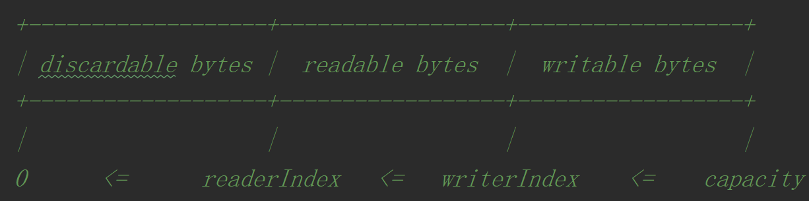

### ByteBuf 结构
　　ByteBuf 结构如下图，有三个指针，readerIndex（读指针）、writerIndex（写指针） 和 capacity（容量）。

- 从 0 到 readerIndex，为无效区间；
- readerIndex 到 writerIndex，为可读区间，读数据是从读指针开始；
- writerIndex 到 capacity，为可写区间，写数据从写指针开始；
- capacity 到 maxCapacity，即容量可进行扩容，最大扩容到 maxCapacity。



　　默认实现类为 [AbstractByteBuf]()，下面为 AbstractByteBuf 的方法。

### read、write、set 方法
　　如下为 AbstractByteBuf 的 read 方法，按照不同类型，读指针读取的字节不同。以 readInt 方法为例，读取读指针后四个字节。**该方法 readInt 使用模板方法设计模式，_getInt 为抽象方法，交由子类实现，** 最后读指针会加上 4 个字节。

```java
    protected abstract int _getInt(int index);

    @Override
    public int readInt() {
        checkReadableBytes0(4);
        int v = _getInt(readerIndex);
        readerIndex += 4;
        return v;
    }
    
    protected abstract long _getLong(int index);
    
    @Override
    public long readLong() {
        checkReadableBytes0(8);
        long v = _getLong(readerIndex);
        readerIndex += 8;
        return v;
    }
```

### mark、reset 方法

- 调用 markReaderIndex 方法保存当前读指针，当读指针继续往后读，可使用 resetReaderIndex 复原到原来保存的位置；
- markWriterIndex 和 resetWriterIndex 也是同理。确保在读完一段数据后或写完一段数据后，还能保持原样。

```java
    @Override
    public ByteBuf markReaderIndex() {
        markedReaderIndex = readerIndex;
        return this;
    }

    @Override
    public ByteBuf resetReaderIndex() {
        readerIndex(markedReaderIndex);
        return this;
    }

    @Override
    public ByteBuf markWriterIndex() {
        markedWriterIndex = writerIndex;
        return this;
    }

    @Override
    public ByteBuf resetWriterIndex() {
        writerIndex(markedWriterIndex);
        return this;
    }
```

### clear
　　清除，即将读指针和写指针指向 0，写指针会重新写，覆盖之前写的。

```java
    @Override
    public ByteBuf clear() {
        readerIndex = writerIndex = 0;
        return this;
    }
```

### readableBytes、writableBytes、maxWritableBytes

- readableBytes，写指针 - 读指针，可读区间；
- writableBytes，容量 - 写指针，可写区间；
- maxCapacity - writerIndex，最大容量 - 写指针，最大可写区间。

```java
    @Override
    public int readableBytes() {
        return writerIndex - readerIndex;
    }
    
    @Override
    public int writableBytes() {
        return capacity() - writerIndex;
    }

    @Override
    public int maxWritableBytes() {
        return maxCapacity() - writerIndex;
    }
```
