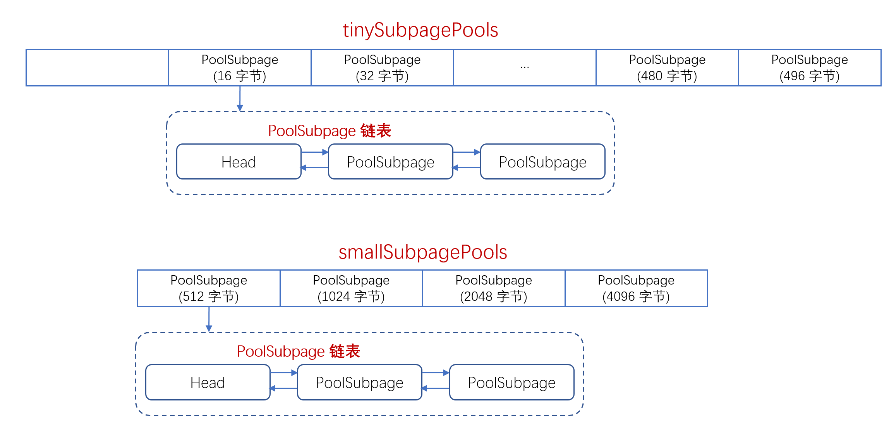

### PoolArena
　　有两种数据结构，PoolChunkList 和 PoolSubpage。内存大小分类，分为 Tiny（16B 的整数倍，即 null、16、32、48，有 32 个）、Small（512B、1k、2K、4K） 和 Normal（8K、16K、32K）。

### PoolChunkList

- PoolChunkList 为双向链表，包含 6 个 ChunkList，而一个 ChunkList 又由多个 Chunk（一个 Chunk 为 16M） 组成；
- 每个 ChunkList 表示不同使用率的集合， 比如 q050 的 ChunkList 表示该集合下的 chunk 最小使用率为 50%，最大使用率为 100%。使用链表形式，是为了便于移动、删除 Chunk，当一个 Chunk 的使用率发生变化，可移动该 Chunk 到对应使用率的 ChunkList 集合中。


### PoolSubpage

- 一个 Chunk 为 16M，一个 Chunk 分为 2048 个 page，一个 page 为 8K。一个 page 下又分为 tinySubpagePools 和 smallSubpagePools；
    1. smallSubpagePools，为 PollSubpage 数组，包含 4 个 PollSubpage 对象；
    2. tinySubpagePools，为 PollSubpage 数组，包含 32 个 PollSubpage对象。
- 假设要分配的内存为 16K，则取一个 Chunk 下的两个 page；
- 如果需要的内存为 2K，则取一个 page 下的 subpage（small 的）。subpage 的大小不固定，根据第一次请求分配的大小为单位（最小为 16B 的 tiny）。比如，第一次请求分配 32B，则 Page 按照 32B 均匀切分为 256 个，16B 则切分为 512 个。



```java
abstract class PoolArena<T> implements PoolArenaMetric {
    static final boolean HAS_UNSAFE = PlatformDependent.hasUnsafe();

    // 内存大小分类
    enum SizeClass {
        Tiny,
        Small,
        Normal
    }

    // 512 右移 4 位，相当于除以 16, 即 512 / 16 = 32
    static final int numTinySubpagePools = 512 >>> 4;

    final PooledByteBufAllocator parent;

    // 满二叉树的高度，默认为 11
    private final int maxOrder;
    // Page 大小，默认 8KB = 8192B
    final int pageSize;
    // 默认为 13， 1 << 13 = 8192
    final int pageShifts;
    // chunk 块内存的大小，默认为 16M
    final int chunkSize;
    // 判断分配请求内存是否为 Tiny/Small ，即分配 Subpage 内存块
    final int subpageOverflowMask;
    // 数组的大小，默认为 23
    final int numSmallSubpagePools;
    // 对齐基准
    final int directMemoryCacheAlignment;
    // 掩码
    final int directMemoryCacheAlignmentMask;
    // subpage 为 2k
    // tiny 类型的 PoolSubpage 数组，数组的每个元素，都是双向链表
    private final PoolSubpage<T>[] tinySubpagePools;
    // small 类型的 SubpagePools 数组，数组的每个元素，都是双向链表
    private final PoolSubpage<T>[] smallSubpagePools;

    // PoolChunkList 为双向链表，默认有 6 个 ChunkList
    // 每个 ChunkList 表示不同使用率的集合，比如 q050
    // 最小使用率为 50%，最大使用率为 100%
    private final PoolChunkList<T> q050;
    private final PoolChunkList<T> q025;
    private final PoolChunkList<T> q000;
    private final PoolChunkList<T> qInit;
    private final PoolChunkList<T> q075;
    private final PoolChunkList<T> q100;

    private final List<PoolChunkListMetric> chunkListMetrics;

    // Metrics for allocations and deallocations
    // 分配 Normal 内存块的次数
    private long allocationsNormal;
    // We need to use the LongCounter here as this is not guarded via synchronized block.
    // tiny 内存块的计数器
    // 分配 Tiny 内存块的次数
    private final LongCounter allocationsTiny = PlatformDependent.newLongCounter();
    // small 内存块的计数器
    private final LongCounter allocationsSmall = PlatformDependent.newLongCounter();
    // huge 内存块的计数器
    private final LongCounter allocationsHuge = PlatformDependent.newLongCounter();
    // 正在使用中的 Huge 内存块的总共占用字节数
    private final LongCounter activeBytesHuge = PlatformDependent.newLongCounter();

    // 释放 Tiny 内存块的次数
    private long deallocationsTiny;
    private long deallocationsSmall;
    private long deallocationsNormal;

    // We need to use the LongCounter here as this is not guarded via synchronized block.
    private final LongCounter deallocationsHuge = PlatformDependent.newLongCounter();

    // Number of thread caches backed by this arena.
    // 该 PoolArena 被多少线程引用的计数器
    final AtomicInteger numThreadCaches = new AtomicInteger();

    // TODO: Test if adding padding helps under contention
    //private long pad0, pad1, pad2, pad3, pad4, pad5, pad6, pad7;

    protected PoolArena(PooledByteBufAllocator parent, int pageSize,
          int maxOrder, int pageShifts, int chunkSize, int cacheAlignment) {
        this.parent = parent;
        this.pageSize = pageSize;
        this.maxOrder = maxOrder;
        this.pageShifts = pageShifts;
        this.chunkSize = chunkSize;
        directMemoryCacheAlignment = cacheAlignment;
        directMemoryCacheAlignmentMask = cacheAlignment - 1;
        subpageOverflowMask = ~(pageSize - 1);
        tinySubpagePools = newSubpagePoolArray(numTinySubpagePools);
        // 初始化 tinySubpagePools 数组
        for (int i = 0; i < tinySubpagePools.length; i ++) {
            tinySubpagePools[i] = newSubpagePoolHead(pageSize);
        }
        // 初始化 smallSubpagePools 数组
        numSmallSubpagePools = pageShifts - 9;
        smallSubpagePools = newSubpagePoolArray(numSmallSubpagePools);
        for (int i = 0; i < smallSubpagePools.length; i ++) {
            smallSubpagePools[i] = newSubpagePoolHead(pageSize);
        }

        // 双向链表连接
        q100 = new PoolChunkList<T>(this, null, 100, Integer.MAX_VALUE, chunkSize);
        q075 = new PoolChunkList<T>(this, q100, 75, 100, chunkSize);
        q050 = new PoolChunkList<T>(this, q075, 50, 100, chunkSize);
        q025 = new PoolChunkList<T>(this, q050, 25, 75, chunkSize);
        q000 = new PoolChunkList<T>(this, q025, 1, 50, chunkSize);
        qInit = new PoolChunkList<T>(this, q000, Integer.MIN_VALUE, 25, chunkSize);

        q100.prevList(q075);
        q075.prevList(q050);
        q050.prevList(q025);
        q025.prevList(q000);
        q000.prevList(null);
        qInit.prevList(qInit);

        List<PoolChunkListMetric> metrics = new ArrayList<PoolChunkListMetric>(6);
        metrics.add(qInit);
        metrics.add(q000);
        metrics.add(q025);
        metrics.add(q050);
        metrics.add(q075);
        metrics.add(q100);
        chunkListMetrics = Collections.unmodifiableList(metrics);
    }

    private PoolSubpage<T> newSubpagePoolHead(int pageSize) {
        PoolSubpage<T> head = new PoolSubpage<T>(pageSize);
        head.prev = head;
        head.next = head;
        return head;
    }
```

