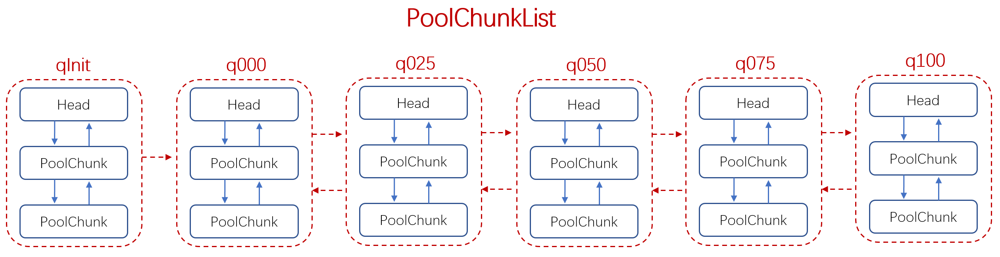

### allocate

- newByteBuf()，从对象池 Recycler 获取 ByteBuf 对象，如果没有，则直接创建；
- 初始化 ByteBuf 对象，即重置读写指针、重置读写指针的标记值等；
- allocate()，在该 ByteBuf 对象上，进行内存分配。

```java
    PooledByteBuf<T> allocate(PoolThreadCache cache, int reqCapacity, int maxCapacity) {
        PooledByteBuf<T> buf = newByteBuf(maxCapacity);
        // 内存分配
        allocate(cache, buf, reqCapacity);
        return buf;
    }
```

### newByteBuf
　　以 DirectArena 为例，默认情况下，是有 Unsafe 的，即调用 PooledUnsafeDirectByteBuf。

```java
    @Override
    protected PooledByteBuf<ByteBuffer> newByteBuf(int maxCapacity) {
        // 默认情况下，是有 Unsafe 的
        if (HAS_UNSAFE) {
            return PooledUnsafeDirectByteBuf.newInstance(maxCapacity);
        } else {
            return PooledDirectByteBuf.newInstance(maxCapacity);
        }
    }
```

#### PooledUnsafeDirectByteBuf#newInstance

- [Recycler#get](https://github.com/martin-1992/Netty-Notes/blob/master/Recycler/get.md)，获取 ByteBuf 对象，如果没有，则直接创建。PooledUnsafeDirectByteBuf 实现了 newObject 方法，当从对象池中没有获取到对象时，会调用该方法创建对象，具体可看 Recycler#get；
- PooledByteBuf#reuse，初始化 ByteBuf 对象，即重置读写指针、重置读写指针的标记值等，脏数据仍存在。

```java
    static PooledUnsafeDirectByteBuf newInstance(int maxCapacity) {
        // 获取 ByteBuf 对象，如果没有，则直接创建
        PooledUnsafeDirectByteBuf buf = RECYCLER.get();
        // 设置读写指针、最大扩容容量等
        buf.reuse(maxCapacity);
        // 获取初始化好的 ByteBuf
        return buf;
    }

    private static final Recycler<PooledUnsafeDirectByteBuf> RECYCLER = new Recycler<PooledUnsafeDirectByteBuf>() {
        @Override
        protected PooledUnsafeDirectByteBuf newObject(Handle<PooledUnsafeDirectByteBuf> handle) {
            // 如果没对应的 ByteBuf 对象，则调用 newObject 方法直接创建，对象是绑定
            // 在 handle.value 上，由 handle 调用 recycle 方法来回收对象
            return new PooledUnsafeDirectByteBuf(handle, 0);
        }
    };
    
    /**
     * PooledByteBuf#reuse
     */
    final void reuse(int maxCapacity) {
        // 最大扩容容量
        maxCapacity(maxCapacity);
        // 设置应用，表示当前的 ByteBuf 被多个地方进行引用
        setRefCnt(1);
        // 重置读写指针
        setIndex0(0, 0);
        // 重置读写指针的标记值
        discardMarks();
    }
```

### allocate



- 标准化请求的内存容量，为 2 的次方，从大到小来判断；
- 使用位运算，根据请求容量判断。
- 小于 512 为 tiny，调用 [cache.allocateTiny](https://github.com/martin-1992/Netty-Notes/blob/master/Netty%20%E5%86%85%E5%AD%98%E7%AE%A1%E7%90%86/PoolThreadCache/allocateTiny.md)；
- 如果缓存 tinySubPageDirectCaches 有可使用的对象，则获取对象，进行内存分配；
- 没有则 cache.allocateTiny 为 false，设置 table = tinySubpagePools 进行内存分配；
- 最后释放内存时，会将 tinySubpagePools 分配的对象放入 tinySubPageDirectCaches，下次可从缓存 tinySubPageDirectCaches 中获取。

```java
    private void allocate(PoolThreadCache cache, PooledByteBuf<T> buf, final int reqCapacity) {
        // 标准化请求的内存容量，为 2 的次方，从大到小来判断
        final int normCapacity = normalizeCapacity(reqCapacity);
        // 小于 pageSize，即为 tiny 或 small，capacity < pageSize
        if (isTinyOrSmall(normCapacity)) {
            int tableIdx;
            PoolSubpage<T>[] table;
            // 使用位运算，小于 512 是 tiny，而 512 到 pageSize 则为 small
            boolean tiny = isTiny(normCapacity);
            if (tiny) { // < 512
                // allocateTiny、allocateSmall、allocateNormal 处理逻辑都类似，
                // 如果没有缓存对象，则需要创建缓存对象，在内存中分配
                if (cache.allocateTiny(this, buf, reqCapacity, normCapacity)) {
                    // was able to allocate out of the cache so move on
                    return;
                }
                // 没有可用的缓存对象，直接进行内存分配，先根据请求容量 normCapacity，计算要分配的对象大小，
                // tinySubpagePools 包含 32 个 PollSubpage对象，从 16 字节到 496 字节。比如 tiny[1]=16B，
                // tiny[2]=32B，tiny[3]=48B，这样如果是 32B，则 32 除以 16，取第二个。
                tableIdx = tinyIdx(normCapacity);
                table = tinySubpagePools;
            } else {
                // 运行过程同 allocateTiny 类似
                if (cache.allocateSmall(this, buf, reqCapacity, normCapacity)) {
                    // was able to allocate out of the cache so move on
                    return;
                }
                tableIdx = smallIdx(normCapacity);
                table = smallSubpagePools;
            }
            // PollSubpage 对象是以链表形式串联起来的
            final PoolSubpage<T> head = table[tableIdx];

            synchronized (head) {
                final PoolSubpage<T> s = head.next;
                if (s != head) {
                    assert s.doNotDestroy && s.elemSize == normCapacity;
                    long handle = s.allocate();
                    assert handle >= 0;
                    s.chunk.initBufWithSubpage(buf, null, handle, reqCapacity);
                    incTinySmallAllocation(tiny);
                    return;
                }
            }
            synchronized (this) {
                allocateNormal(buf, reqCapacity, normCapacity);
            }

            incTinySmallAllocation(tiny);
            return;
        }
        // 小于 16M 时的缓存分配，以 page 来分的
        if (normCapacity <= chunkSize) {
            // 在缓存上进行内存分配，分配成功则 return
            if (cache.allocateNormal(this, buf, reqCapacity, normCapacity)) {
                // was able to allocate out of the cache so move on
                return;
            }
            // 如果在缓存上分配不成功，则在做实际的内存分配，首次是分配不到，因为没有缓存
            synchronized (this) {
                // page 级别的分配
                allocateNormal(buf, reqCapacity, normCapacity);
                ++allocationsNormal;
            }
        } else {
            // 如果分配的内存 normCapacity 大于 chunkSize，则使用 allocateHuge 直接在内存上分配
            // Huge allocations are never served via the cache so just call allocateHuge
            allocateHuge(buf, reqCapacity);
        }
    }
```

#### tinyIdx
　　把 normCapacity 除以 16，因为 tiny 的数组是按 16 的倍数排的，比如 tiny[1]=16B，tiny[2]=32B，tiny[3]=48B，这样如果是 32B，则 32 除以 16，取第二个。

```java
    static int tinyIdx(int normCapacity) {
        return normCapacity >>> 4;
    }
```

