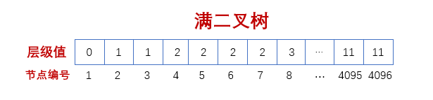
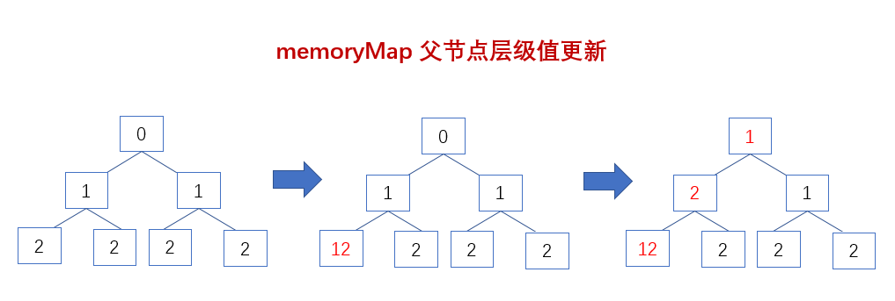

### allocateNode

- 从根节点开始往下遍历，不断获取层级值 val，直到 val >= d，返回该 val。比如 d 为 5，则获取的 val 为 5，则退出循环；
- 然后一级一级往上更新父节点的层级值；
- 返回该节点的节点编号。



```java
    private int allocateNode(int d) {
        // 第一个节点，即根节点编号，因为二叉树是用数组实现的
        int id = 1;
        // 获取该层的初始节点，比如 d 为 11，则该层初始节点为 -2048
        int initial = - (1 << d); 
        // 根节点的值，即对应的层级值为 0
        byte val = value(id);
        // 根节点的层级值 val 为 0，如果 val > d，表示 d 小于 0，即请求的容量大于 16M，
        // 这样计算 d = maxOrder - (log2(normCapacity) - pageShifts) 才会小于 0
        if (val > d) { // unusable
            return -1;
        }
        // 层级值 d 越大，则其占用的内存值越小，往下遍历，不断获取层级值 val，直到 val >= d，返回该 val
        while (val < d || (id & initial) == 0) {
            // 下一层的首个节点（左节点）
            id <<= 1;
            // 该节点的层级值
            val = value(id);
            // 左节点的层级值 val 大于 d，表示没有节点可分配，即没有足够的内存分配，
            // 因为值越大，可分配的内存越小，对右节点进行判断
            if (val > d) {
                // 选择右节点进行判断是否有足够的内存进行分配
                id ^= 1;
                val = value(id);
            }
        }
        // 获取该 id 对应的层级值，层级值对应内存值，比如层级值为 11，表示内存值为 8k。
        // 层级值为 10，表示内存值为 16k
        byte value = value(id);
        assert value == d && (id & initial) == 1 << d : String.format("val = %d, id & initial = %d, d = %d",
                value, id & initial, d);
        // 设置该节点的值不可用，即赋值为 12，之后在比较 val > d，可判断为是
        setValue(id, unusable); // mark as unusable
        // 一级一级往上更新父节点的层级值
        updateParentsAlloc(id);
        return id;
    }
```

#### value
　　获取该节点 id 对应的层级值，层级值越大，则其可用的内存越小。

- 层级值为 0，可用内存为一个 Chunk（默认 16M），有一个；
- 层级值为 1，可用内存为 8M，有两个；
- 层级值为 11，可用内存为 8K，有 2048 个。

```java
    private byte value(int id) {
        return memoryMap[id];
    }
```

#### setValue
　　设置该节点 id 的层级值。

```java
    private void setValue(int id, byte val) {
        memoryMap[id] = val;
    }
```

#### updateParentsAlloc
　　遍历更新父节点的层级值，过程如下图。



```java
    private void updateParentsAlloc(int id) {
        // 遍历更新父节点的层级值
        while (id > 1) {
            // 父节点的 ID
            int parentId = id >>> 1;
            byte val1 = value(id);
            byte val2 = value(id ^ 1);
            byte val = val1 < val2 ? val1 : val2;
            setValue(parentId, val);
            id = parentId;
        }
    }
```
