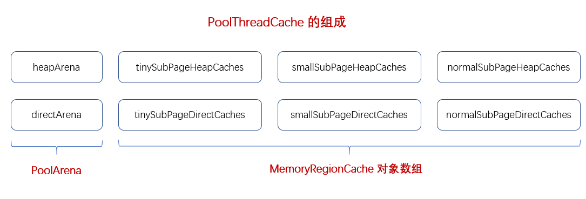
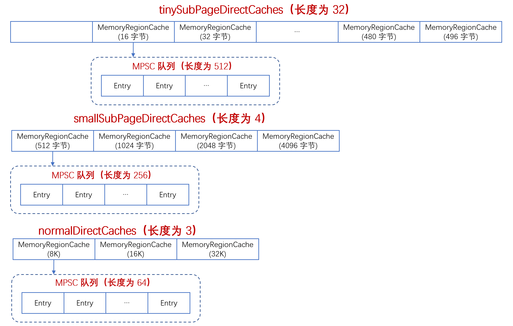

### PoolThreadCache
　　有两种结构，为 [PoolArena](https://github.com/martin-1992/Netty-Notes/tree/master/Netty%20%E5%86%85%E5%AD%98%E7%AE%A1%E7%90%86/PoolArena) 和 [MemoryRegionCache](https://github.com/martin-1992/Netty-Notes/tree/master/Netty%20%E5%86%85%E5%AD%98%E7%AE%A1%E7%90%86/PoolThreadCache/MemoryRegionCache)，如下图。PoolArena 为内存分配器，当内存用完后，会将内存对象存入 MemoryRegionCache 中。所以代码中会先判断 MemoryRegionCache 是否有可用的内存，没有才会调用 PoolArena进行创建。



　　PoolThreadCache 为每个线程维护一个缓存对象的列表，缓存分为堆内 heap 和直接内存 direct。默认使用直接内存，**避免每次调用本地 I/O 操作之前（或之后）将缓冲区的内容复制到（或从）中间缓冲区，** 不是由 JVM 管理，需要手动释放内存。以直接内存为例，该列表有 tiny、small 和 normal 三种类型的缓存，这三种是预先申请的。而大于 16M 的，则由 JVM 直接申请内存。<br />
　　缓存是以数组形式 byte[] 申请的，tinySubPageDirectCaches 有 32 个 MemoryRegionCache，每个 MemoryRegionCache 绑定一个队列，该队列长度为 512，如下图。



　　同理，smallSubPageDirectCaches 有 4 个 MemoryRegionCache，每个 MemoryRegionCache 绑定一个队列，该队列长度为 256。normalDirectCaches 有 3 个 MemoryRegionCache，每个 MemoryRegionCache 绑定一个队列，该队列长度为 64。

```java
final class PoolThreadCache {

    private static final InternalLogger logger = InternalLoggerFactory.getInstance(PoolThreadCache.class);
    
    // 堆内的内存分配器
    final PoolArena<byte[]> heapArena;
    // 堆外（直接）的内存分配器
    final PoolArena<ByteBuffer> directArena;

    // PoolThreadCache 为每个线程都会维护的一个对象，所有每个线程都会有 tiny, small 和 normal
    // 这三种类型的缓存，缓存以数组形式 byte[]，比如 tiny[1] 表示 16B 的缓存 queue，这里有 6
    // 种，又分为 heap 和 direct，以 tinySubPageDirectCaches 为例，查看初始化的地方
    private final MemoryRegionCache<byte[]>[] tinySubPageHeapCaches;
    private final MemoryRegionCache<byte[]>[] smallSubPageHeapCaches;
    private final MemoryRegionCache<ByteBuffer>[] tinySubPageDirectCaches;
    private final MemoryRegionCache<ByteBuffer>[] smallSubPageDirectCaches;
    private final MemoryRegionCache<byte[]>[] normalHeapCaches;
    private final MemoryRegionCache<ByteBuffer>[] normalDirectCaches;
```


### 构造函数

- 使用变量保存 heapArena 和 directArena；
- 创建 tinySubPageDirectCaches，为 MemoryRegionCache 数组，包含 32 个 MemoryRegionCache，每个 MemoryRegionCache 又包含一个长度为 512 的队列；
- 创建 smallSubPageDirectCaches，为 MemoryRegionCache 数组；
- 创建 normalDirectCaches，为 MemoryRegionCache 数组；

```java
    static final int numTinySubpagePools = 512 >>> 4;

    final int numSmallSubpagePools;

    PoolThreadCache(PoolArena<byte[]> heapArena, PoolArena<ByteBuffer> directArena,
                    int tinyCacheSize, int smallCacheSize, int normalCacheSize,
                    int maxCachedBufferCapacity, int freeSweepAllocationThreshold) {
        checkPositiveOrZero(maxCachedBufferCapacity, "maxCachedBufferCapacity");
        this.freeSweepAllocationThreshold = freeSweepAllocationThreshold;
        // 使用变量保存 heapArena 和 directArena
        this.heapArena = heapArena;
        this.directArena = directArena;
        if (directArena != null) {
            // 创建 tinySubPageDirectCaches，为 MemoryRegionCache 数组，包含 32 个 MemoryRegionCache，
            // 每个 MemoryRegionCache 又包含一个长度为 512 的队列
            tinySubPageDirectCaches = createSubPageCaches(
                    tinyCacheSize, PoolArena.numTinySubpagePools, SizeClass.Tiny);
            // small 和 normal 原理同 tiny 类似
            smallSubPageDirectCaches = createSubPageCaches(
                    smallCacheSize, directArena.numSmallSubpagePools, SizeClass.Small);

            numShiftsNormalDirect = log2(directArena.pageSize);
            normalDirectCaches = createNormalCaches(
                    normalCacheSize, maxCachedBufferCapacity, directArena);

            directArena.numThreadCaches.getAndIncrement();
        } else {
            // ...
    }
```

#### createSubPageCaches
　　以 tiny 为例，创建一个 MemoryRegionCache 的数组。

- 创建一个 MemoryRegionCache 的数组，numCaches 为传进去的 numTinySubpagePools，默认大小为 32；
- 遍历 MemoryRegionCache 数组，为每个 [MemoryRegionCache](https://github.com/martin-1992/Netty-Notes/tree/master/Netty%20%E5%86%85%E5%AD%98%E7%AE%A1%E7%90%86/PoolThreadCache/MemoryRegionCache) 调用其构造函数，创建 MPSC 队列。其长度为 512（cacheSize），缓存类型为 tiny（sizeClass）；

```java
    private static <T> MemoryRegionCache<T>[] createSubPageCaches(
            int cacheSize, int numCaches, SizeClass sizeClass) {
        if (cacheSize > 0 && numCaches > 0) {
            // cache 在每个 PoolThreadLocal 里维护的一个缓存的对象
            // 在 tinySubPageDirectCaches 中，numCaches 为 32
            @SuppressWarnings("unchecked")
            MemoryRegionCache<T>[] cache = new MemoryRegionCache[numCaches];
            for (int i = 0; i < cache.length; i++) {
                // TODO: maybe use cacheSize / cache.length
                // 每种类型的 cache 都表示不同类型的内存大小的队列
                // cacheSize 当做变量穿进去，即这种大小的内存最终能
                // 创建多少个
                // 在创建每个 32 长度的 MemoryRegionCache 时，它的每个节点都会继续调用
                // SubPageMemoryRegionCache
                cache[i] = new SubPageMemoryRegionCache<T>(cacheSize, sizeClass);
            }
            return cache;
        } else {
            return null;
        }
    }
```
