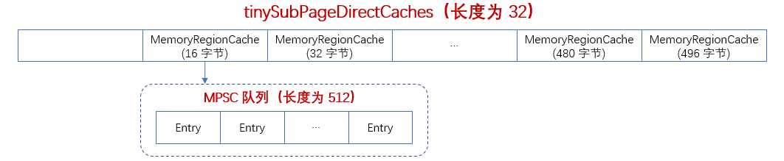

### allocateTiny

- cacheForTiny，根据请求容量 normCapacity 找到对应的 MemoryRegionCache 的节点（MemoryRegionCache 绑定一个队列）。tiny 是按 16（>>4） 的倍数来划分的，即 null、16B、32B、48B，直到 496B，有 32 个。比如请求容量 normCapacity 为 32，则 32 >>> 4 为 2，分配在 tiny 数组中索引位置为 2。注意 索引 0 为空的，不分配；
- allocate，从 MemoryRegionCache 绑定的队列中获取一个对象 Entry 给 ByteBuf，进行初始化，分配缓存。

```java
    boolean allocateTiny(PoolArena<?> area, PooledByteBuf<?> buf, int reqCapacity, int normCapacity) {
        // cacheForTiny，找到 MemoryRegionCache 的节点
        return allocate(cacheForTiny(area, normCapacity), buf, reqCapacity);
    }
```

### cacheForTiny
　　根据请求容量获取分配在内存数组中的位置，因为 tinySubPageDirectCaches 是按 16B、32B、48B... 来分配的。比如请求容量 normCapacity 为 32，则 32 >>> 4 为 2，分配在 tiny 数组中索引位置为 2。注意 索引 0 为空的，不分配。索引 1 为 16B，索引 2 为 32B。<br />
　　注意，tinySubPageDirectCaches 为缓存，**第一次调用 allocate 时，tinySubPageDirectCaches 数组中的元素为空，没有缓存的对象。**



```java
    private MemoryRegionCache<?> cacheForTiny(PoolArena<?> area, int normCapacity) {
        // 根据请求容量获取分配在内存数组中的位置，比如请求容量 normCapacity 为 32，
        // 则 32 >>> 4 为 2，分配在 tiny 数组中索引位置为 2
        int idx = PoolArena.tinyIdx(normCapacity);
        // 分配内存的数组为直接内存
        if (area.isDirect()) {
            return cache(tinySubPageDirectCaches, idx);
        }
        // 堆内内存 tiny 数组，为 MemoryRegionCache 对象的数组
        return cache(tinySubPageHeapCaches, idx);
    }
    
    /**
     * 把 normCapacity 除以 16，因为 tiny 的数组是按 16 的倍数排的，比如 tiny[1]=16B，tiny[2]=32B，
     * tiny[3]=48B，这样如果是 32B，则 32 除以 16，取第二个
     */
    static int tinyIdx(int normCapacity) {
        return normCapacity >>> 4;
    }
```

#### cache
　　获取该索引下的 MemoryRegionCache。

```java
    private static <T> MemoryRegionCache<T> cache(MemoryRegionCache<T>[] cache, int idx) {
        // 参数校验
        if (cache == null || idx > cache.length - 1) {
            return null;
        }
        // 使用下标，获取数组的值，比如 32B / 16 = 2，获取 cache[2]，即为 32B
        return cache[idx];
    }
```

### allocate

- 第一次调用 allocate 时，tinySubPageDirectCaches 数组中的元素为空，没有缓存的对象，返回 false；
- [cache.allocate](https://github.com/martin-1992/Netty-Notes/blob/master/Netty%20%E5%86%85%E5%AD%98%E7%AE%A1%E7%90%86/PoolThreadCache/MemoryRegionCache/allocate.md)，MemoryRegionCache 绑定一个队列，从该队列获取一个对象 Entry 给 ByteBuf，进行初始化。
- trim，释放 MemoryRegionCache 数组中没有分配给 ByteBuf 的内存，防止内存泄漏。

```java
    private boolean allocate(MemoryRegionCache<?> cache, PooledByteBuf buf, int reqCapacity) {
        // 第一次调用时，tinySubPageDirectCaches 中的缓存对象为空，所以返回 false
        if (cache == null) {
            return false;
        }
        // MemoryRegionCache 绑定一个队列，从该队列获取一个对象 Entry 给 ByteBuf，进行初始化
        boolean allocated = cache.allocate(buf, reqCapacity);
        if (++ allocations >= freeSweepAllocationThreshold) {
            allocations = 0;
            // 释放
            trim();
        }
        return allocated;
    }
```
