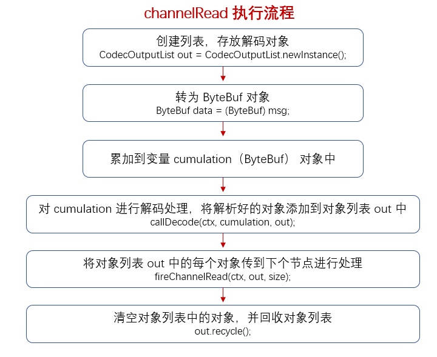
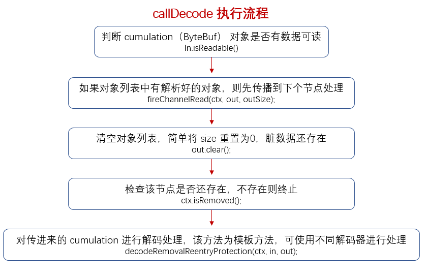

### ByteToMessageDecoder
　　Netty 底层的解码器都是基于 ByteToMessageDecoder 实现的，其执行流程是将二进制流数据解析成一个个对象，添加到对象列表中，然后传给下个节点。

- 创建对象列表；
- 创建一个 ByteBuf 的变量 cumulation，用于累加收到的数据；
- 将数据进行累加，然后调用抽象的解码方法 callDecode，由子类具体实现，将 ByteBuf 解码为对象，添加到对象列表中；
- 将对象列表传给下个节点 ChannelHandlerContext，进行处理。

### 设计模式
　　模板方法模式，ByteToMessageDecoder 为抽象基类，包含模板方法 callDecode，不同解码类通过继承 ByteToMessageDecoder 实现各自的模板方法，除了具体的解码，其它流程则由 ByteToMessageDecoder 来执行。

### ByteToMessageDecoder#channelRead
　　在 pipeline 每个节点 ChannelHandlerContext，都会调用 ChannelRead() 进行解码处理。



- 创建列表，用于存放解码后的对象，通过列表可获取到一个个解析对象，传播到下个节点；
- 将读取到的二进制流数据累加到累加器中；
- 调用 callDecode，对累加器（二进制流数据）进行解码处理，解码成对象添加到对象列表中；
- 调用 [fireChannelRead](https://github.com/martin-1992/Netty-Notes/blob/master/Netty%20%E8%A7%A3%E7%A0%81/fireChannelRead.md) 将对象列表传播到下个节点；
- 清空对象列表中的对象，即遍历对象列表，将每个对象置为 null，并回收对象列表；

```java
    @Override
    public void channelRead(ChannelHandlerContext ctx, Object msg) throws Exception {
        // 判断 msg 为 ByteBuf，则进行解码处理，不是则传给下个节点 ChannelHandlerContext
        if (msg instanceof ByteBuf) {
            // 创建列表，用于存放解码后的对象，通过列表可获取到一个个解析对象，向下进行传播
            CodecOutputList out = CodecOutputList.newInstance();
            try {
                // 转为 ByteBuf 对象，msg 为二进制数据
                ByteBuf data = (ByteBuf) msg;
                // 累加器 cumulation 为 null，即第一次从 IO 流中读取数据
                first = cumulation == null;
                if (first) {
                    // 将累加器赋值为二进制数据，完成累加
                    cumulation = data;
                } else {
                    // 如果 cumulation 不为 null，表示已经有二进制数据进行累加，则将读取的数据累加到当前的数据中
                    cumulation = cumulator.cumulate(ctx.alloc(), cumulation, data);
                }
                // 解码处理
                callDecode(ctx, cumulation, out);
            } catch (DecoderException e) {
                throw e;
            } catch (Exception e) {
                throw new DecoderException(e);
            } finally {
                // cumulation 不为 null，但没有可读的，表示所有的
                // 二进制数据已经处理转为对象，于是释放掉内存
                if (cumulation != null && !cumulation.isReadable()) {
                    numReads = 0;
                    cumulation.release();
                    cumulation = null;
                } else if (++ numReads >= discardAfterReads) {
                    // We did enough reads already try to discard some bytes so we not risk to see a OOME.
                    // See https://github.com/netty/netty/issues/4275
                    numReads = 0;
                    discardSomeReadBytes();
                }
                // 记录解析为对象的列表 out 的长度
                int size = out.size();
                decodeWasNull = !out.insertSinceRecycled();
                // 向下传播解析到的对象列表 out
                fireChannelRead(ctx, out, size);
                // 将对象列表 out 中的每个对象进行回收（置为 null）
                out.recycle();
            }
        } else {
            // 不是 ByteBuf 类型，则向下进行传播
            ctx.fireChannelRead(msg);
        }
    }
```


### ByteToMessageDecoder#callDecode



- 先检查，如果对象列表 out 中有对象，先传播到下个节点；
- 传播完成后，清空当前对象列表 out 的对象（置为 null）；
- 调用 decodeRemovalReentryProtection，使用了模板方法的设计模式，核心的解码 decode 为抽象方法，交由子类实现。解析二进制流数据，将解析后的对象放入对象列表 out；
- 解码完成后，检查列表的大小是否有变动、可读指针是否有变化；
    1. 列表的大小没变，可读指针没变，表示没有新数据进来，现成的数据数据又无法解码成对象，结束解码流程；
    2. 列表的大小没变，可读指针有变化，有新数据进来，跳过下面执行流程，循环再进行一次解码；
    3. 列表的大小没变，可读指针没变，抛出异常。

```java
    protected void callDecode(ChannelHandlerContext ctx, ByteBuf in, List<Object> out) {
        try {
            // 累加器有数据可读，读指针小于写指针
            while (in.isReadable()) {
                int outSize = out.size();
                // 如果对象列表 out 中有对象，先传播到下个节点
                if (outSize > 0) {
                    fireChannelRead(ctx, out, outSize);
                    // 传播完成后，清空当前对象列表 out 的对象（置为 null）
                    out.clear();

                    // Check if this handler was removed before continuing with decoding.
                    // If it was removed, it is not safe to continue to operate on the buffer.
                    //
                    // See:
                    // - https://github.com/netty/netty/issues/4635
                    // 修复 bug，解码中时不能执行删除 handler 操作，只能解码完才可以进行删除
                    if (ctx.isRemoved()) {
                        break;
                    }
                    outSize = 0;
                }
                // 记录当前读指针的位置
                int oldInputLength = in.readableBytes();
                // 解析二进制流数据，将解析后的对象放入对象列表 out
                decodeRemovalReentryProtection(ctx, in, out);

                // Check if this handler was removed before continuing the loop.
                // If it was removed, it is not safe to continue to operate on the buffer.
                //
                // See https://github.com/netty/netty/issues/1664
                // 修复 bug
                if (ctx.isRemoved()) {
                    break;
                }
                // 表示经过解码后，列表还是为 null，没有添加对象
                if (outSize == out.size()) {
                    // 如果可读指针还是没变，表示没有新数据进来，现成的数据数据又无法解码成对
                    // 象，比如使用行解码器，规定 5 个字节解码成一个对象，但传进来的 ByteBuf
                    // 只有 3 字节，就没法解码成对象
                    if (oldInputLength == in.readableBytes()) {
                        break;
                    } else {
                        // 有新数据进来，跳过下面执行流程，循环再进行一次解码
                        continue;
                    }
                }
                // 表示已经解码出新的对象，添加到列表中。但可读指针应该往后移，而不是不变，于是抛出异常
                if (oldInputLength == in.readableBytes()) {
                    throw new DecoderException(
                            StringUtil.simpleClassName(getClass()) +
                                    ".decode() did not read anything but decoded a message.");
                }
                // isSingleDecode 为 true，表示只解码一次添加对象到列表，不循环解码添加对象到列表中
                if (isSingleDecode()) {
                    break;
                }
            }
        } catch (DecoderException e) {
            throw e;
        } catch (Exception cause) {
            throw new DecoderException(cause);
        }
    }
```


### decodeRemovalReentryProtection
　　该方法使用模板方法的设计模式，decode 为抽象方法，由子类实现，子类从累加器 in 获取二进制流数据，然后将解析到的对象添加到对象列表 out 中。

```java
    final void decodeRemovalReentryProtection(ChannelHandlerContext ctx, ByteBuf in, List<Object> out)
            throws Exception {
        decodeState = STATE_CALLING_CHILD_DECODE;
        try {
            decode(ctx, in, out);
        } finally {
            boolean removePending = decodeState == STATE_HANDLER_REMOVED_PENDING;
            decodeState = STATE_INIT;
            if (removePending) {
                handlerRemoved(ctx);
            }
        }
    }
```

