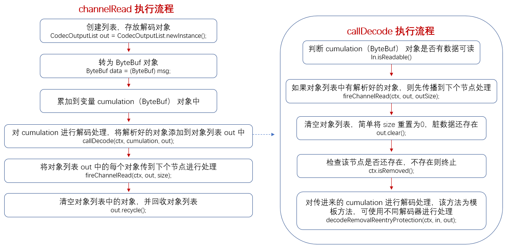

### Netty 解码
　　Netty 解码是将一串二进制流解码成多个 ByteBuf（自定义协议数据包），然后交给业务逻辑进行处理。

### [ByteToMessageDecoder](https://github.com/martin-1992/Netty-Notes/blob/master/Netty%20%E8%A7%A3%E7%A0%81/ByteToMessageDecoder.md)
　　Netty 底层的解码器都是基于 ByteToMessageDecoder 实现的，其执行流程是将二进制流数据解析成一个个对象，添加到对象列表中，然后传给下个节点。

### [fireChannelRead](https://github.com/martin-1992/Netty-Notes/blob/master/Netty%20%E8%A7%A3%E7%A0%81/fireChannelRead.md)
　　pipeline 为双向链表，使用当前节点的 next 指针或 prev 指针获取下个节点，将 ByteToMessageDecoder 解码出来的对象作为参数传入下个节点的 ChannelRead 方法中。

### [FixedLengthFrameDecoder]()
　　基于固定长度来切割，比如固定长度为 3，则将 | A | BC | DEFG | HI | 切割为 | ABC | DEF | GHI |，然后每个 3 字节的二进制流数据转为 ByteBuf 对象。
