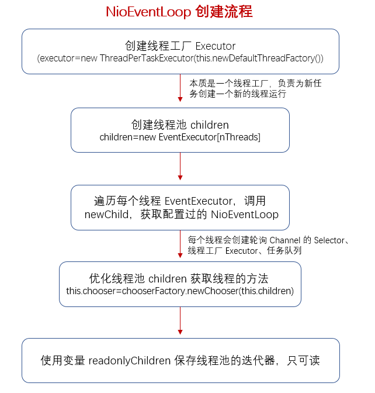
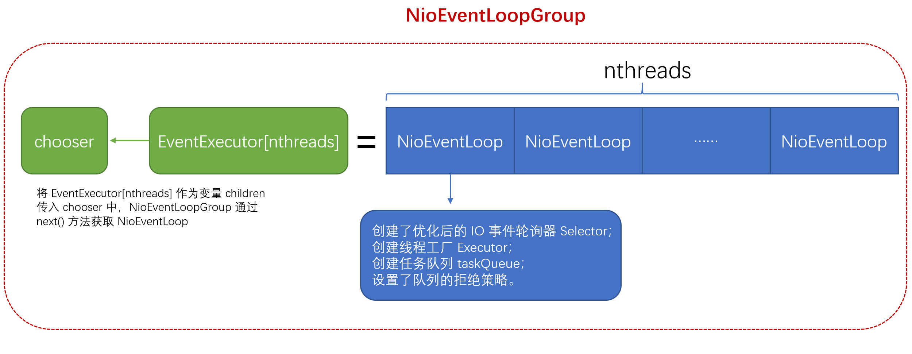
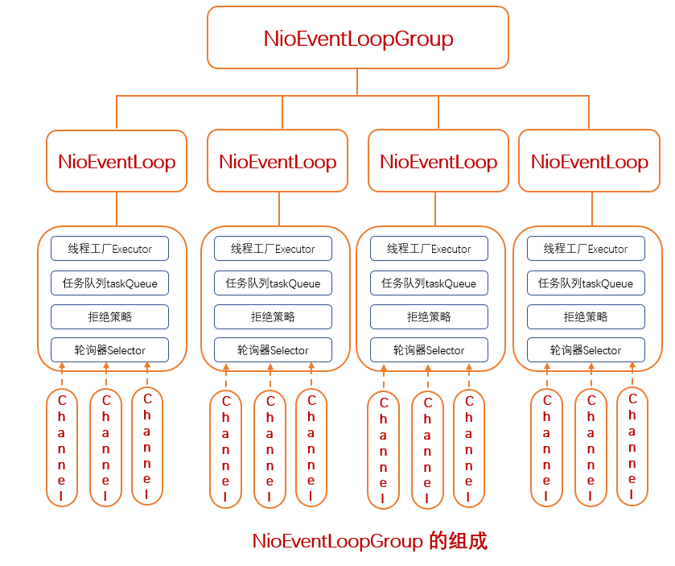

### NioEventLoopGroup
　　服务端启动时会创建两个 group，NioEventLoopGroup 为 NioEventLoop 的数组。NioEventLoopGroup 的构造函数是由父类定义的，从 NioEventLoopGroup -> MultithreadEventLoopGroup -> MultithreadEventExecutorGroup，在 MultithreadEventExecutorGroup 类的 MultithreadEventExecutorGroup 方法实现。<br />
　　**在 NioEventLoop 中会创建 Selector，** 具体可看 [NioEventLoop 的构造函数](https://github.com/martin-1992/Netty-Notes/blob/master/NioEventLoop/NioEventLoop%20%E7%9A%84%E5%88%9B%E5%BB%BA/NioEventLoop%20%E7%9A%84%E6%9E%84%E9%80%A0%E5%87%BD%E6%95%B0.md)。

```java
EventLoopGroup bossGroup = new NioEventLoopGroup(1);
// new NioEventLoopGroup() 为 new NioEventLoopGroup(0)，为 0 时默认使用 2 * cpu
EventLoopGroup workerGroup = new NioEventLoopGroup();
```



### MultithreadEventExecutorGroup
　　NioEventLoopGroup 最终会调用 MultithreadEventExecutorGroup 类的构造函数，nThreads 为线程数，每个新连接会绑定一个 NioEventLoop。当连接数超过线程数，会重新从 0 开始绑定，比如线程数为 8，第 9 个连接进来，则绑定第一个线程。

- 初次创建时，executor 为空，需创建线程工厂 [newDefaultThreadFactory](https://github.com/martin-1992/Netty-Notes/blob/master/NioEventLoop/NioEventLoop%20%E7%9A%84%E5%88%9B%E5%BB%BA/DefaultThreadFactory.md)，并作为变量传入 [ThreadPerTaskExecutor](https://github.com/martin-1992/Netty-Notes/blob/master/NioEventLoop/NioEventLoop%20%E7%9A%84%E5%88%9B%E5%BB%BA/ThreadPerTaskExecutor.md) 中，完成 Executor 的创建。在 [Java 并发编程实战第八章]() 讲到 Executor 确保任务不会并发执行。
    1. 因为对象封闭在任务线程中，即使这些对象是非线程安全也没问题，不需要加锁。但注意需确保 Executor 为单线程才行，在 Netty 中 Executor 是单线程的，并且使用信号量 Semaphore(1) 确保只有一个线程执行任务队列的任务；
    2. 虽然有多个 NioEventLoop，每个 NioEventLoop 都各有一个 Executor，但 Channel 是注册到单个 NioEventLoop，所以 Channel 的 IO 任务是在注册的那个 NioEventLoop 下执行的，为单线程环境；
- 创建 EventExecutor 数组，其大小为线程数；
- 遍历 EventExecutor 数组，调用 [newChild](https://github.com/martin-1992/Netty-Notes/blob/master/NioEventLoop/NioEventLoop%20%E7%9A%84%E5%88%9B%E5%BB%BA/newChild.md)，返回新建的 NioEventLoop 对象。**包含创建的 Selector、任务队列，为每个 EventExecutor 配置线程工厂 Executor、IO 事件轮询器 Selector 和任务队列。** EventExecutor 数组可理解为线程池，之后从池中获取线程对象 NioEventLoop；
    1. 创建新线程放入线程池中，每个线程会保存一个线程工厂 Executor（用于执行任务队列的非 IO 任务）、一个 Selector（用于轮询 Channel，执行 IO 任务）、一个任务队列；
    2. 一个 Selector 绑定一个线程 NioEventLoop，一个 Selector 下有多个 Channel（包装的 Socket）；
    3. 每个 Selector 轮询注册到该 Selector 下的 Channel，当有 IO 任务时，调用 [NioEventLoop#processSelectedKeys](https://github.com/martin-1992/Netty-Notes/blob/master/NioEventLoop/NioEventLoop%20%E7%9A%84%E5%90%AF%E5%8A%A8/processSelectedKeys.md) 异步执行任务；
- [chooserFactory.newChooser(children)](https://github.com/martin-1992/Netty-Notes/blob/master/NioEventLoop/NioEventLoop%20%E7%9A%84%E5%88%9B%E5%BB%BA/newChooser.md)，**将之前创建的 EventExecutor 数组（为 NioEventLoop 对象数组）放入 newChooser 中，通过 next() 方法，即轮询从 NioEventLoopGroup 中获取 NioEventLoop，处理新的 Channel。** chooser 优化了线程池获取线程（NioEventLoop）的方式，使用数组方式，做了优化，根据数组长度，判断创建数组的长度是否为 2 的次方，能否使用位运算获取索引下标；
- 添加线程终止的监听器；
- 使用变量 readonlyChildren 保存线程池 EventExecutor 的集合，用于迭代器，只可读。



```java
    protected MultithreadEventExecutorGroup(int nThreads, Executor executor,
                                            EventExecutorChooserFactory chooserFactory, Object... args) {
        if (nThreads <= 0) {
            throw new IllegalArgumentException(String.format("nThreads: %d (expected: > 0)", nThreads));
        }

        if (executor == null) {
            // 创建线程工厂
            executor = new ThreadPerTaskExecutor(newDefaultThreadFactory());
        }
        // 创建线程池 EventExecutor 数组，其大小为线程数，nThreads 在 EventLoopGroup bossGroup = new NioEventLoopGroup(1)
        // 进行设置，这里 nThreads 为 1，因为是 boss 线程，负责读取连接，而连接成功的线程会注册到 worker 线程池，负责数据读写
        children = new EventExecutor[nThreads];

        for (int i = 0; i < nThreads; i ++) {
            boolean success = false;
            try {
                // 创建新线程放入线程池中
                children[i] = newChild(executor, args);
                success = true;
            } catch (Exception e) {
                // TODO: Think about if this is a good exception type
                throw new IllegalStateException("failed to create a child event loop", e);
            } finally {
                // 失败，则关闭之前已创建好的线程对象
                if (!success) {
                    for (int j = 0; j < i; j ++) {
                        children[j].shutdownGracefully();
                    }

                    for (int j = 0; j < i; j ++) {
                        EventExecutor e = children[j];
                        try {
                            while (!e.isTerminated()) {
                                e.awaitTermination(Integer.MAX_VALUE, TimeUnit.SECONDS);
                            }
                        } catch (InterruptedException interrupted) {
                            // Let the caller handle the interruption.
                            Thread.currentThread().interrupt();
                            break;
                        }
                    }
                }
            }
        }
        // 根据数组长度，判断创建数组的长度是否为 2 的次方，能否使用位运算获取索引下标
        chooser = chooserFactory.newChooser(children);

        final FutureListener<Object> terminationListener = new FutureListener<Object>() {
            @Override
            public void operationComplete(Future<Object> future) throws Exception {
                if (terminatedChildren.incrementAndGet() == children.length) {
                    terminationFuture.setSuccess(null);
                }
            }
        };
        // 添加线程终止的监听器
        for (EventExecutor e: children) {
            e.terminationFuture().addListener(terminationListener);
        }
        // 用于迭代器的集合，只可读
        Set<EventExecutor> childrenSet = new LinkedHashSet<EventExecutor>(children.length);
        Collections.addAll(childrenSet, children);
        readonlyChildren = Collections.unmodifiableSet(childrenSet);
    }
```



#### MultithreadEventExecutorGroup#newDefaultThreadFactory
　　传入当前类的类名，这里为 MultithreadEventExecutorGroup，作为线程工厂的名称前缀。[DefaultThreadFactory]() 创建线程工厂，用于创建新线程。

```java
    protected ThreadFactory newDefaultThreadFactory() {
        return new DefaultThreadFactory(getClass());
    }
```

#### NioEventLoopGroup#newChild
　　newChild 在 MultithreadEventExecutorGroup 为抽象方法，以 NioEventLoopGroup 为例，创建 NioEventLoop 线程。

```java
    @Override
    protected EventLoop newChild(Executor executor, Object... args) throws Exception {
        return new NioEventLoop(this, executor, (SelectorProvider) args[0],
            ((SelectStrategyFactory) args[1]).newSelectStrategy(), (RejectedExecutionHandler) args[2]);
    }
```
