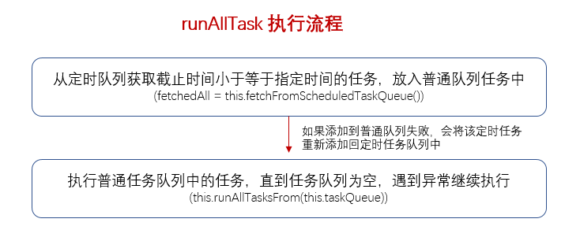

### SingleThreadEventExecutor#runAllTasks

- 获取定时队列的任务，将截止小于等于指定时间的定时任务，放入普通队列任务中；
- 执行普通队列的任务，直到所有任务执行完成，任务队列为空；
- 记录执行时间；
- afterRunningAllTasks 为抽象方法，由子类实现，即执行完所有任务后，需要做什么？比如打印日志等。

```java
    protected boolean runAllTasks() {
        // 当前线程是否在 EventLoop 线程中
        assert inEventLoop();
        boolean fetchedAll;
        boolean ranAtLeastOne = false;

        do {
            // 获取定时队列的任务，将截止小于等于指定时间的定时任务，放入普通队列任务中
            fetchedAll = fetchFromScheduledTaskQueue();
            // 当普通任务队列的任务执行完后，设置 ranAtLeastOne 为 true
            if (runAllTasksFrom(taskQueue)) {
                ranAtLeastOne = true;
            }
        } while (!fetchedAll); // keep on processing until we fetched all scheduled tasks.

        if (ranAtLeastOne) {
            // 普通任务队列的任务全部执行完后，计算上次执行多久
            lastExecutionTime = ScheduledFutureTask.nanoTime();
        }
        // 由子类实现，每次循环结束，即执行完所有任务后，需要做什么？比如打印日志
        afterRunningAllTasks();
        return ranAtLeastOne;
    }
```

### SingleThreadEventExecutor#runAllTasks(long timeoutNanos)
　　和 runAllTasks() 唯一区别在于该方法会每执行 64 次任务判断有没超过 timeoutNanos，超时则不执行。在 [NioEventLoop 的启动]() 中设置了 ioRatio 为 50，**使用时间片方式，来轮询处理 Channel 中的读写事件和任务队列中的事件。** 防止处理任务队列的时间太长，导致没法处理 Channel 中的读写事件。



```java
    protected boolean runAllTasks(long timeoutNanos) {
        // 获取定时队列的任务，将截止小于等于指定时间的定时任务，放入普通队列任务中
        fetchFromScheduledTaskQueue();
        // 从普通任务队列中获取任务
        Runnable task = pollTask();
        if (task == null) {
            // 子类实现，任务队列为空，则结束执行，子类自定结束执行后的操作
            afterRunningAllTasks();
            return false;
        }
        // 超时时间
        final long deadline = ScheduledFutureTask.nanoTime() + timeoutNanos;
        long runTasks = 0;
        long lastExecutionTime;
        // 循环执行任务队列中的任务，直到任务队列为空或超时
        for (;;) {
            // 执行任务，异常也不中断，只打印日志
            safeExecute(task);

            runTasks ++;

            // Check timeout every 64 tasks because nanoTime() is relatively expensive.
            // XXX: Hard-coded value - will make it configurable if it is really a problem.
            // 累计执行任务数，当达到 64 次时（0x3F 为 64），计算下当前时间，如果当前时间超过
            // 前面设置的截止时间，后面的任务则不执行了。之所以不每次都计算，是因为 nanoTime
            // 是一项相对耗时的操作
            if ((runTasks & 0x3F) == 0) {
                lastExecutionTime = ScheduledFutureTask.nanoTime();
                if (lastExecutionTime >= deadline) {
                    break;
                }
            }
            // 从任务队列中获取任务
            task = pollTask();
            if (task == null) {
                lastExecutionTime = ScheduledFutureTask.nanoTime();
                break;
            }
        }

        afterRunningAllTasks();
        this.lastExecutionTime = lastExecutionTime;
        return true;
    }
```

#### SingleThreadEventExecutor#fetchFromScheduledTaskQueue
　　获取定时队列的任务，将截止小于等于指定时间的定时任务，放入普通队列任务中执行。

```java
private boolean fetchFromScheduledTaskQueue() {
        // 当前时间 - 开始时间
        long nanoTime = AbstractScheduledEventExecutor.nanoTime();
        // 使用该时间 nanoTime 判断是否小于定时任务队列的第一个任务的截止时间，是则将该任务添加到
        // 普通的任务队列中执行
        Runnable scheduledTask  = pollScheduledTask(nanoTime);
        while (scheduledTask != null) {
            // 添加不成功，则重新添加到定时任务队列中
            if (!taskQueue.offer(scheduledTask)) {
                // No space left in the task queue add it back to the scheduledTaskQueue so we pick it up again.
                scheduledTaskQueue().add((ScheduledFutureTask<?>) scheduledTask);
                return false;
            }
            // 添加成功，则继续获取任务，直到没有任务小于等于截止时间
            scheduledTask  = pollScheduledTask(nanoTime);
        }
        return true;
    }
```

#### SingleThreadEventExecutor#fetchFromScheduledTaskQueue
　　执行普通队列的任务，直到所有任务执行完成，任务队列为空。如出现异常，不中断执行，而是打印日志。

```java
    protected final boolean runAllTasksFrom(Queue<Runnable> taskQueue) {
        // 从普通队列中获取任务
        Runnable task = pollTaskFrom(taskQueue);
        if (task == null) {
            return false;
        }
        // 循环执行普通任务队列的任务，直到队列为空
        for (;;) {
            // 执行任务
            safeExecute(task);
            // 获取任务
            task = pollTaskFrom(taskQueue);
            if (task == null) {
                return true;
            }
        }
    }
    
    protected static Runnable pollTaskFrom(Queue<Runnable> taskQueue) {
        for (;;) {
            // 队头任务
            Runnable task = taskQueue.poll(); // <1>
            // 如果该任务为空任务（WAKEUP_TASK），跳过，该任务只是用于唤醒 EventLoop 线程
            if (task == WAKEUP_TASK) {
                continue;
            }
            return task;
        }
    }
```

#### AbstractEventExecutor#safeExecute
　　如出现异常，不中断执行，而是打印日志。

```java
    protected static void safeExecute(Runnable task) {
        try {
            task.run();
        } catch (Throwable t) {
            logger.warn("A task raised an exception. Task: {}", task, t);
        }
    }
```
