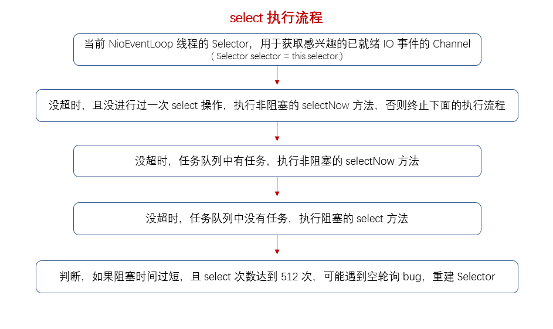
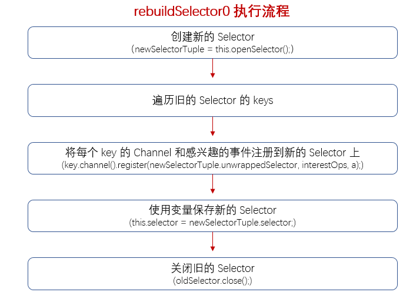

### NioEventLoop#select
　　使用轮询发现 Channel 感兴趣的 IO 事件，封装了 JDK 底层的 select 的三种方法，阻塞式的 selector.select()、非阻塞式的 selectNow()、带时间的阻塞 select(timeoutMillis) 。因为 jdk 底层的 Selector 会出现 bug，所以 **Netty 通过计算阻塞时间和 select 次数，来判断是否触发空轮询 bug，是则重建 Selector 来避免空轮询 bug。**

- [SelectStrategy#calculateStrategy](https://github.com/martin-1992/Netty-Notes/blob/master/NioEventLoop/NioEventLoop%20%E7%9A%84%E5%90%AF%E5%8A%A8/SelectStrategy.md)，获取策略；
- select 次数为 0 时，会进行一次非阻塞的 select 操作，返回 Channel 新增的感兴趣的就绪 IO 事件数量；
- 通过计算阻塞时间和 select 次数，来判断是否触发空轮询 bug，是则重建 Selector 来避免空轮询 bug；

```java
    @Override
    protected void run() {
        for (;;) {
            try {
                try {
                    // 轮询 IO 事件，一个 Selector 对应一个 NioEventLoop，select 方法返回 Channel 新增的感兴趣的就绪 IO 事件数量
                    switch (selectStrategy.calculateStrategy(selectNowSupplier, hasTasks())) {
                    case SelectStrategy.CONTINUE:
                        continue;

                    case SelectStrategy.BUSY_WAIT:

                    case SelectStrategy.SELECT:
                        // 每次进行 select 操作，使用 CAS 其设为 false，未唤醒状态
                        select(wakenUp.getAndSet(false));
                        
                        // 判断是否需要唤醒，是则唤醒 selector 线程
                        if (wakenUp.get()) {
                            selector.wakeup();
                        }
                        // fall through
                    default:
                    }
                } catch (IOException e) {
                    // 重建 Selector，避免空轮询的 bug
                    rebuildSelector0();
                    handleLoopException(e);
                    continue;
                }
                // ...
```


### NioEventLoop#select
　　当一个或多个 Channel 注册到 Selector 后，调用 select 方法，返回所感兴趣的事件的已就绪的 Channel。如果对读事件感兴趣，则会返回读已就绪的 Chanel。



- 变量 selectCnt 记录 Select 的次数，当遇到空轮询 bug 时，该 selectCnt 会疯狂增加，超过阈值则进行重建 Selector；
- 使用计时来判断执行 select 操作的时间，如果超时，且没有进行过一次 select 操作，则进行非阻塞的 selectNow 操作。超时，且进行过一次 select 操作，则中止；
- 没超时，且异步队列有任务，调用非阻塞的 selectNow 方法执行任务；
- 没超时，任务队列中没任务，进行阻塞式的 select 操作；
- 进行条件判断，是否要中止本次 select 操作；
- 如果当前时间 time >= 操作时间 timeoutMillis + 上次记录的开始时间 currentTimeNanos，表示进行了一次阻塞式的 select 操作，如果当前时间 < 操作时间 timeoutMillis + 上次记录的开始时间 currentTimeNanos，表示没有阻塞那么长时间，继续判断 selectCnt 的次数是否超过阈值 SELECTOR_AUTO_REBUILD_THRESHOLD（默认 512），是则可能触发空轮询 bug，重建 Selector。

```java
    private void select(boolean oldWakenUp) throws IOException {
        // 当前 NioEventLoop 线程实例的 Selector，一个 Selector 对应一个 NioEventLoop
        Selector selector = this.selector;
        try {
            // 记录 Select 的次数，当遇到空轮询 bug 时，该 selectCnt 会疯狂增加
            int selectCnt = 0;
            // 开始时间
            long currentTimeNanos = System.nanoTime();
            // 开始时间 + 截止时间，NioEventLoop 底层有个定时任务队列，即当前执行 select 操作的时间不能超过该时间
            long selectDeadLineNanos = currentTimeNanos + delayNanos(currentTimeNanos);

            for (;;) {
                // 计算是否超时
                long timeoutMillis = (selectDeadLineNanos - currentTimeNanos + 500000L) / 1000000L;
                // 超时，且没有进行过一次 select 操作，进行非阻塞的 select 方法
                if (timeoutMillis <= 0) {
                    if (selectCnt == 0) {
                        selector.selectNow();
                        selectCnt = 1;
                    }
                    // 超时，且进行一次 select，则终止
                    break;
                }

                // 没超时，任务队列中有任务，通过 CAS 将其设为 true，表示 selector 已经 wakeUp，
                // 无阻塞返回所感兴趣的事件的已就绪的 Channel，并将 selectCnt 重置为 1
                if (hasTasks() && wakenUp.compareAndSet(false, true)) {
                    selector.selectNow();
                    selectCnt = 1;
                    break;
                }
                // 没超时，任务队列中没任务，进行阻塞式的 select 操作
                int selectedKeys = selector.select(timeoutMillis);
                selectCnt ++;

                // 已经轮询 select 过 / 当前 select 操作是否需要唤醒 / 执行 select 操作已经被外部线程唤醒 /
                // 异步队列已有任务 / 当前定时队列里有任务，满足任意条件本次 select 操作终止
                if (selectedKeys != 0 || oldWakenUp || wakenUp.get() || hasTasks() || hasScheduledTasks()) {
                    break;
                }
                // 该 NioEventLoop 已经中断
                if (Thread.interrupted()) {
                    if (logger.isDebugEnabled()) {
                        logger.debug("Selector.select() returned prematurely because " +
                                "Thread.currentThread().interrupt() was called. Use " +
                                "NioEventLoop.shutdownGracefully() to shutdown the NioEventLoop.");
                    }
                    selectCnt = 1;
                    break;
                }

                long time = System.nanoTime();
                // 如果当前时间 time >= 操作时间 timeoutMillis + 上次记录的开始时间 currentTimeNanos，
                // 表示进行了一次阻塞式的 select 操作，如果当前时间 < 操作时间 timeoutMillis + 上次记
                // 录的开始时间 currentTimeNanos，表示没有阻塞那么长时间，继续判断 selectCnt 的次数是
                // 否超过阈值 SELECTOR_AUTO_REBUILD_THRESHOLD（默认 512），是则可能触发空轮询 bug，重
                // 建 Selector
                if (time - TimeUnit.MILLISECONDS.toNanos(timeoutMillis) >= currentTimeNanos) {
                    // timeoutMillis elapsed without anything selected.
                    selectCnt = 1;
                } else if (SELECTOR_AUTO_REBUILD_THRESHOLD > 0 &&
                        selectCnt >= SELECTOR_AUTO_REBUILD_THRESHOLD) {
                    // 调用该方法，把旧的 selector 上面的所有 select key 注册到新的 selector 上，在新的 selector
                    // 上执行阻塞式操作，可能不会发生空轮询的 bug
                    selector = selectRebuildSelector(selectCnt);
                    selectCnt = 1;
                    break;
                }

                currentTimeNanos = time;
            }

            // 警告，selectCnt 过早执行 3 次，可能是触发空轮询 bug
            if (selectCnt > MIN_PREMATURE_SELECTOR_RETURNS) {
                if (logger.isDebugEnabled()) {
                    logger.debug("Selector.select() returned prematurely {} times in a row for Selector {}.",
                            selectCnt - 1, selector);
                }
            }
        } catch (CancelledKeyException e) {
            if (logger.isDebugEnabled()) {
                logger.debug(CancelledKeyException.class.getSimpleName() + " raised by a Selector {} - JDK bug?",
                        selector, e);
            }
            // Harmless exception - log anyway
        }
    }
```


### NioEventLoop#selectRebuildSelector
　　重建 Selector，保存 新的 Selector，在新的 Selector 上再次进行无阻塞的 select 方法。

```java
    private Selector selectRebuildSelector(int selectCnt) throws IOException {
        // The selector returned prematurely many times in a row.
        // Rebuild the selector to work around the problem.
        logger.warn(
                "Selector.select() returned prematurely {} times in a row; rebuilding Selector {}.",
                selectCnt, selector);
        // 重建 Selector
        rebuildSelector();
        // 保存新的 Selector
        Selector selector = this.selector;

        // 在新的 Selector 上再次进行无阻塞的 select 方法
        selector.selectNow();
        return selector;
    }
```


### NioEventLoop#rebuildSelector
　　当前线程不为 EventLoop 线程，调用 [SingleThreadEventExecutor#execute](https://github.com/martin-1992/Netty-Notes/blob/master/NioEventLoop/NioEventLoop%20%E7%9A%84%E5%90%AF%E5%8A%A8/SingleThreadEventExecutor%23Execute.md)，放入任务队列中或创建一个新线程（不阻塞当前线程执行），来执行重建 Selector 方法。

```java
    public void rebuildSelector() {
        if (!inEventLoop()) {
            execute(new Runnable() {
                @Override
                public void run() {
                    rebuildSelector0();
                }
            });
            return;
        }
        rebuildSelector0();
    }
```


### NioEventLoop#rebuildSelector0
　　重建 Selector。



- 创建一个新的 Selector；
- 将旧 Selector 所有的 Key 和 Key 对应的 Channel、感兴趣的 IO 事件注册到新的 Selector 上，每个 Key 为一个感兴趣的已就绪 IO 事件的 Channel；
- 关闭旧的 Selector。

```java
    private void rebuildSelector0() {
        final Selector oldSelector = selector;
        final SelectorTuple newSelectorTuple;
        // 旧的 selector 为空，直接返回，不需要重建
        if (oldSelector == null) {
            return;
        }

        try {
            // 创建一个新的 Selector
            newSelectorTuple = openSelector();
        } catch (Exception e) {
            logger.warn("Failed to create a new Selector.", e);
            return;
        }

        // Register all channels to the new Selector.
        int nChannels = 0;
        // 将旧 Selector 所有的 Key 和 Key 对应的 Channel、感兴趣的 IO 事件注册到新的 Selector 上，
        // 每个 Key 为一个 Channel
        for (SelectionKey key: oldSelector.keys()) {
            Object a = key.attachment();
            try {
                if (!key.isValid() || key.channel().keyFor(newSelectorTuple.unwrappedSelector) != null) {
                    continue;
                }
                // key 上感兴趣的 IO 事件
                int interestOps = key.interestOps();
                // 把之前 key 的事件取消
                key.cancel();
                // Key 对应的 Channel、感兴趣的 IO 事件注册到新的 Selector 上
                SelectionKey newKey = key.channel().register(newSelectorTuple.unwrappedSelector, interestOps, a);
                if (a instanceof AbstractNioChannel) {
                    // Update SelectionKey
                    ((AbstractNioChannel) a).selectionKey = newKey;
                }
                nChannels ++;
            } catch (Exception e) {
                logger.warn("Failed to re-register a Channel to the new Selector.", e);
                if (a instanceof AbstractNioChannel) {
                    AbstractNioChannel ch = (AbstractNioChannel) a;
                    ch.unsafe().close(ch.unsafe().voidPromise());
                } else {
                    @SuppressWarnings("unchecked")
                    NioTask<SelectableChannel> task = (NioTask<SelectableChannel>) a;
                    invokeChannelUnregistered(task, key, e);
                }
            }
        }

        selector = newSelectorTuple.selector;
        unwrappedSelector = newSelectorTuple.unwrappedSelector;

        try {
            // time to close the old selector as everything else is registered to the new one
            // 关闭旧的 Selector
            oldSelector.close();
        } catch (Throwable t) {
            if (logger.isWarnEnabled()) {
                logger.warn("Failed to close the old Selector.", t);
            }
        }

        if (logger.isInfoEnabled()) {
            logger.info("Migrated " + nChannels + " channel(s) to the new Selector.");
        }
    }
```

