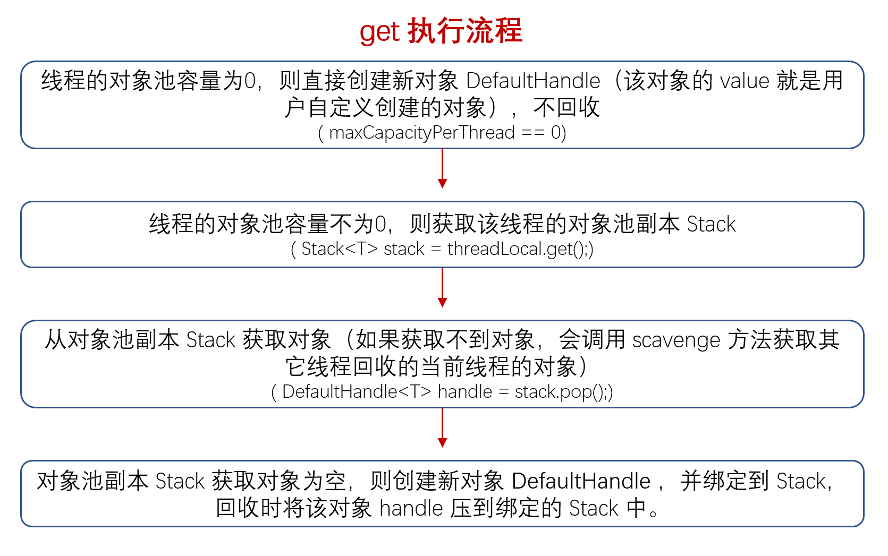

### Recycler#get



- maxCapacityPerThread 为 0，则直接创建对象，用完不回收；
- maxCapacityPerThread 不为 0，则获取对象池的副本；
- 从对象池的副本中获取对象（handle.value），为空则调用用户重写的 newObject 方法创建对象，对象绑定当前线程的 Stack，将该对象注册到 handle.value，然后通过 handle 来获取对象。

```java
    @SuppressWarnings("unchecked")
    public final T get() {
        // 表示对象池容量为 0，则直接创建对象，用完不回收
        if (maxCapacityPerThread == 0) {
            return newObject((Handle<T>) NOOP_HANDLE);
        }
        // 获取对象池，每个线程都有一个对象池的副本
        Stack<T> stack = threadLocal.get();
        // 从对象池中获取对象，该对象和 handle 绑定的，
        // handle.value 即为要获取的对象
        DefaultHandle<T> handle = stack.pop();
        // 调用用户重写的 newObject 方法创建对象，将该对象注册到 handle.value，
        // 然后通过 handle 来获取对象
        if (handle == null) {
            handle = stack.newHandle();
            handle.value = newObject(handle);
        }
        // 要获取的对象
        return (T) handle.value;
    }
```


### stack#pop
　　stack 为 Recycler 的内置类，从栈中弹出 DefaultHandle，获取该对象。如果栈为空，则调用 [scavenge](https://github.com/martin-1992/Netty-Notes/blob/master/Recycler/scavenge.md) 方法从当前线程 Stack 对应的 WeakOrderQueue 链表回收 DefaultHandle 对象。WeakOrderQueue 链表包含每个线程创建的 WeakOrderQueue 节点，比如 WeakOrderQueue（线程 D）-> WeakOrderQueue（线程 B）-> WeakOrderQueue（线程 C） 等。

```java
        @SuppressWarnings({ "unchecked", "rawtypes" })
        DefaultHandle<T> pop() {
            int size = this.size;
            // 从其它线程的 WeakOrderQueue 中回收 DefaultHandle 对象，这些 WeakOrderQueue
            // 都是其他线程在异线程回收对象时创建的，用来暂时保存由 Stack 对应线程创建的
            // DefaultHandle 对象
            if (size == 0) {
                if (!scavenge()) {
                    return null;
                }
                size = this.size;
            }
            size --;
            // 获取 DefaultHandle 对象
            DefaultHandle ret = elements[size];
            // 然后赋值为空，表示已被线程获取使用
            elements[size] = null;
            // 多次回收报异常
            if (ret.lastRecycledId != ret.recycleId) {
                throw new IllegalStateException("recycled multiple times");
            }
            ret.recycleId = 0;
            ret.lastRecycledId = 0;
            this.size = size;
            return ret;
        }
```


#### stack#DefaultHandle
　　创建一个 DefaultHandle 实例，注册到 stack。

```java
    DefaultHandle<T> newHandle() {
        return new DefaultHandle<T>(this);
    }
    
    /**
     * Recycler 的内置类 DefaultHandle
     */
    DefaultHandle(Stack<?> stack) {
        this.stack = stack;
    }
```

#### DefaultHandle
　　Recycler 的内置类 DefaultHandle。

```java
    static final class DefaultHandle<T> implements Handle<T> {
        private int lastRecycledId;
        private int recycleId;

        boolean hasBeenRecycled;
        
        // 绑定的 stack
        private Stack<?> stack;
        // 对象池中的对象，通过调用用户重写的 newObject() 创建
        private Object value;

        DefaultHandle(Stack<?> stack) {
            this.stack = stack;
        }

        @Override
        public void recycle(Object object) {
            if (object != value) {
                throw new IllegalArgumentException("object does not belong to handle");
            }

            Stack<?> stack = this.stack;
            if (lastRecycledId != recycleId || stack == null) {
                throw new IllegalStateException("recycled already");
            }
            // 把 handle 压到栈中
            stack.push(this);
        }
    }
```
