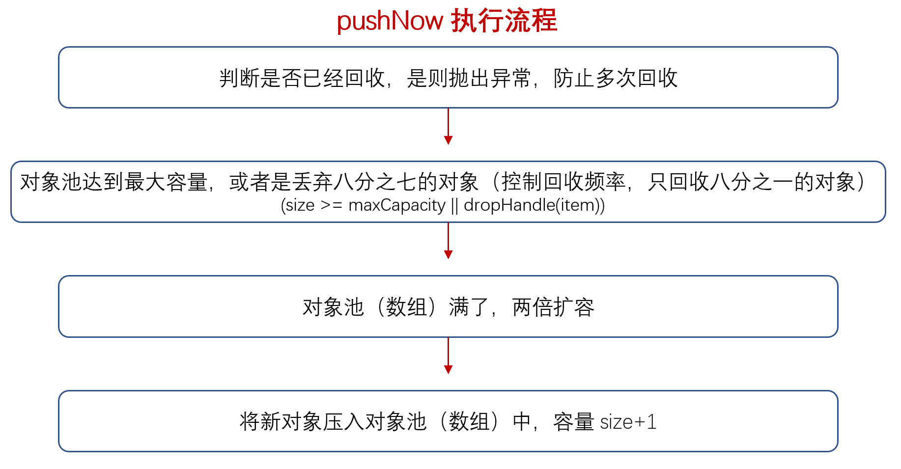
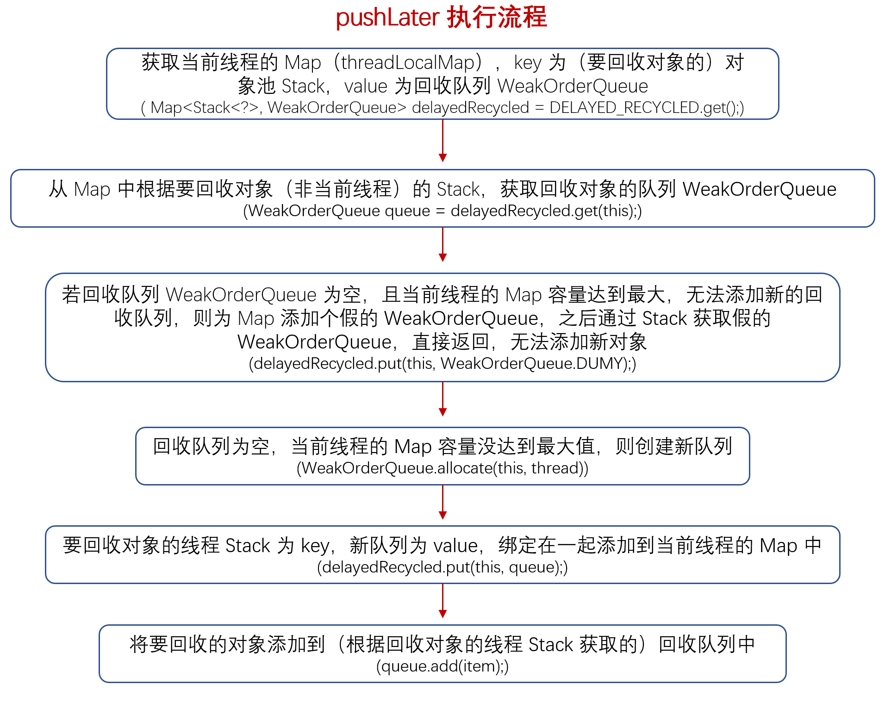
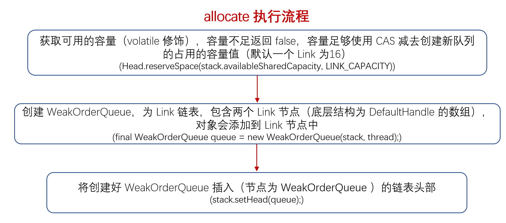

### DefaultHandle#recycle
　　回收对象，调用的是 handle 的方法，因为对象是绑定在 handle 上的（handle.value），所以只需将该线程的 handle 实例压回栈即可。

```java
        @Override
        public void recycle(Object object) {
            if (object != value) {
                throw new IllegalArgumentException("object does not belong to handle");
            }

            Stack<?> stack = this.stack;
            if (lastRecycledId != recycleId || stack == null) {
                throw new IllegalStateException("recycled already");
            }
            // 把 entry 压到栈里
            stack.push(this);
        }
```


### stack#push
　　push 回收对象有两种情况：

- 如果对象是在获取对象的线程中进行回收，则直接调用 pushNow() 方法回收对象；
- 如果对象不是在获取对象的线程中进行回收，则调用 pushLater() 方法进行回收。

```java
    void push(DefaultHandle<?> item) {
        // 获取当前线程
        Thread currentThread = Thread.currentThread();
        // 同线程回收对象
        if (threadRef.get() == currentThread) {
            pushNow(item);
        } else {
            // 不同线程的回收对象
            pushLater(item, currentThread);
        }
    }
```


### stack#pushNow



- 先判断是否已经回收了，是则抛出异常，防止多次回收；
- 对象池 stack 已经达到最大保存容量，或者是第 n 个要回收的对象不为 7 的倍数（控制回收频率，只回收八分之一的对象），则丢弃，不在回收新对象；
- 对象池 stakc (DefaultHandle 数组) 满了，则进行扩容；
- 回收对象，容量加一。

```java
        private void pushNow(DefaultHandle<?> item) {
            // 为 0 表示第一次回收，不为 0 表示已经回收了，不用再回收
            if ((item.recycleId | item.lastRecycledId) != 0) {
                throw new IllegalStateException("recycled already");
            }
            item.recycleId = item.lastRecycledId = OWN_THREAD_ID;

            int size = this.size;
            // 对象池 stack 已经达到最大保存容量，即不能在回收新对象了
            if (size >= maxCapacity || dropHandle(item)) {
                return;
            }
            // 对象池 stakc (DefaultHandle 数组) 满了，则进行两倍扩容
            if (size == elements.length) {
                elements = Arrays.copyOf(elements, min(size << 1, maxCapacity));
            }
            // 回收对象，容量加一
            elements[size] = item;
            this.size = size + 1;
        }
```


#### stack#dropHandle
　　丢弃要回收的对象。如果该对象以前没被回收过，则每隔 8 个进行回收。

```java
        boolean dropHandle(DefaultHandle<?> handle) {
            // 以前没被回收过
            if (!handle.hasBeenRecycled) {
                // ratioMask 为 7，每隔 8 个进行回收，只回收八分之一的对象
                if ((++handleRecycleCount & ratioMask) != 0) {
                    // Drop the object.
                    return true;
                }
                handle.hasBeenRecycled = true;
            }
            return false;
        }
```


### stack#pushLater



- 获取 WeakOrderQueue，用于存放在其它线程创建的对象。比如线程 A 创建对象，线程 B 回收该对象，把该对象放在线程 B 的 WeakOrderQueue（通过线程 A 的 stack 为 key 来获取）。以此类推，线程 C 回收线程 A 的对象，则放在线程 C 的 WeakOrderQueue（通过线程 A 的 stack 为 key 来获取）；
- 如果 WeakOrderQueue 为空，则创建 WeakOrderQueue，将线程 A 的 stack 和线程 B 创建的 WeakOrderQueue 进行绑定，以后可通过 key（线程 A 的 stack）来获取 WeakOrderQueue；
- 将在线程 B 要回收的对象添加到 WeakOrderQueue。

```java
        private void pushLater(DefaultHandle<?> item, Thread thread) {
            // Map 存储了不同线程的 stack 和对应的要回收对象的队列 WeakOrderQueue，由于该线程
            // 可能回收多个其它线程的对象，所以使用 Map 结构，一个异步回收其它线程对应一个队列
            Map<Stack<?>, WeakOrderQueue> delayedRecycled = DELAYED_RECYCLED.get();
            // 获取当前线程的这个 stack 对应的回收队列，比如当前线程 B 异步回收线程 A 的
            // handle 对象，即使用线程 A 的 Stack，获取该线程 A 的队列
            WeakOrderQueue queue = delayedRecycled.get(this);
            // 没有回收过该 stack 的 DefaultHandle，所以
            if (queue == null) {
                // 线程 B 的 Map 达到最大容量，不能再回收其它线程的对象
                if (delayedRecycled.size() >= maxDelayedQueues) {
                    // 为该 Stack 添加一个 WeakOrderQueue.DUMMY，表示以后遇到是该
                    // Stack 要回收的对象，则放弃对象回收
                    delayedRecycled.put(this, WeakOrderQueue.DUMMY);
                    return;
                }
                // 尝试创建队列，为空则返回，丢弃该对象，this 表示要回收的
                // 其他线程对象的 Stack，thread 为当前线程
                if ((queue = WeakOrderQueue.allocate(this, thread)) == null) {
                    // drop object
                    return;
                }
                // 创建的队列绑定当前 Stack，即 key 为 stack，value 为 WeakOrderQueue，
                // 这样就能通过 stack 获取到 WeakOrderQueue
                delayedRecycled.put(this, queue);
            } else if (queue == WeakOrderQueue.DUMMY) {
                // 该Stack 要回收的对象，放弃对象回收
                // drop object
                return;
            }
            // 将要回收的对象添加到队列中
            queue.add(item);
        }
```


### stack#allocate
　　容量足够时，调用 newQueue 创建队列，LINK_CAPACITY 默认为 16，不足时则丢弃该对象回收，WeakOrderQueue 队列结构是为 Link 的链表结构，即有多个 Link 节点，每个 Link 为 16 个单位，允许存放回收 16 个对象（handle），这样就不用每次回收对象都要判断内存是否足够回收，而是每当一个 Link 满了以后，再判断是否能创建下一个 16 单位的 Link，减少操作。



```java
    static WeakOrderQueue allocate(Stack<?> stack, Thread thread) {
        return Head.reserveSpace(stack.availableSharedCapacity, LINK_CAPACITY)
                ? newQueue(stack, thread) : null;
    }
```


#### stack#reserveSpace
　　判断是否有足够容量创建，这里 space 为 LINK_CAPACITY，默认为 16。

```java
    static boolean reserveSpace(AtomicInteger availableSharedCapacity, int space) {
        assert space >= 0;
        for (;;) {
            // 获取可用容量
            int available = availableSharedCapacity.get();
            // 容量不足，返回 false
            if (available < space) {
                return false;
            }
            // 容量足够，使用 CAS 减少可用容量
            if (availableSharedCapacity.compareAndSet(available, available - space)) {
                return true;
            }
        }
    }
```


### WeakOrderQueue#newQueue
　　WeakOrderQueue 为 Recycler 的构造函数，创建新的 WeakOrderQueue，包含 head 和 tail，每个 Link 结构是 handle 数组，使用 next 指针指向下个 Link，每个 Link 可回收 16 个对象（handle），格式为 Link(head) -> Link(tail)。

```java
    static WeakOrderQueue newQueue(Stack<?> stack, Thread thread) {
        final WeakOrderQueue queue = new WeakOrderQueue(stack, thread);
        // 设置新队列为该 stack 的头节点，如下将新创建的线程 A 的 WeakOrderQueue 插入到链表头部
        // WeakOrderQueue（线程 A） -> WeakOrderQueue（线程 C） -> WeakOrderQueue（线程 D）
        stack.setHead(queue);
        return queue;
    }

    private WeakOrderQueue(Stack<?> stack, Thread thread) {
        // 创建一个 DefaultHandle 数组
        tail = new Link();
        head = new Head(stack.availableSharedCapacity);
        head.link = tail;
        owner = new WeakReference<Thread>(thread);
    }

    synchronized void setHead(WeakOrderQueue queue) {
        queue.setNext(head);
        head = queue;
    }
```


### stack#add
　　将要回收的对象放入 Link 中。

- 判断是否能写入 Link（tail）中，不能写入则尝试分配内存，创建新的 Link；
- 内存不足，创建失败，则放弃该对象的回收；
- 创建新的 Link，添加到尾部，Link -> Link -> (new) Link；
- 将该对象写入 Link 中，同时更新写指针 + 1。

```java
        void add(DefaultHandle<?> handle) {
            handle.lastRecycledId = id;

            Link tail = this.tail;
            int writeIndex;
            // 获取 Link 的长度（默认 16），当 Link 满了后，无法写入，则需创建
            // 新的 Link，写入到新的 Link 中
            if ((writeIndex = tail.get()) == LINK_CAPACITY) {
                // 内存不足，无法分配新的 Link，放弃该对象的回收
                if (!head.reserveSpace(LINK_CAPACITY)) {
                    // Drop it.
                    return;
                }
                // We allocate a Link so reserve the space
                // 创建新的 Link，添加到尾部
                this.tail = tail = tail.next = new Link();
                // 重新获取写指针，为 0
                writeIndex = tail.get();
            }
            // 将该对象放入 Link 中，Link 为 DefaultHandle 的数组结构
            tail.elements[writeIndex] = handle;
            // 表示这个 Handle 不属于这个 stack
            handle.stack = null;
            // 写指针 + 1
            tail.lazySet(writeIndex + 1);
        }
```

