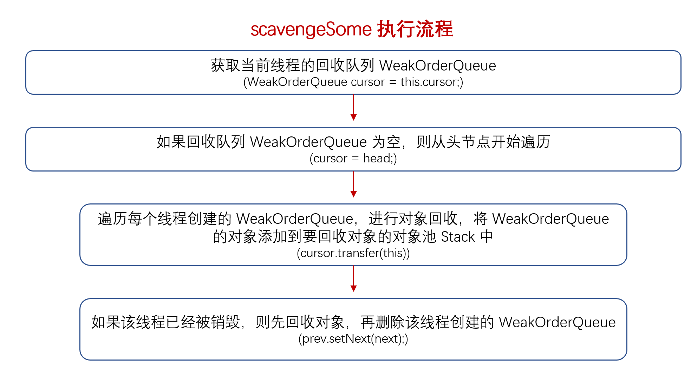

### stack#scavenge
　　回收对象。

```java
    boolean scavenge() {
        // 已经回收部分对象，返回 true
        if (scavengeSome()) {
            return true;
        }

        // 没有回收对象，则重置，下次从头节点 head 开始遍历 WeakOrderQueue，
        // 即 WeakOrderQueue(head) -> WeakOrderQueue -> ...
        prev = null;
        cursor = head;
        return false;
    }
```

### stack#scavengeSome



- 判断，如果该 Stack 没有对应的 WeakOrderQueue，则返回；
- 遍历包含 WeakOrderQueue 节点（线程）的链表，如果某个节点（线程）已经被销毁，则尝试将 WeakOrderQueue 中的对象添加到 Stack 中，从链表中删除该 WeakOrderQueue 节点（线程），比如 WeakOrderQueue -> WeakOrderQueue(删除） -> WeakOrderQueue；
- 调用 transfer，将该节点（线程） WeakOrderQueue 中的对象添加到当前线程 Stack 中，WeakOrderQueue 是由多个 Link 组成，读取 Link，将 Link 中的对象添加到 Stack 中。

```java
        boolean scavengeSome() {
            WeakOrderQueue prev;
            WeakOrderQueue cursor = this.cursor;
            // cursor 为空，则从头开始遍历
            if (cursor == null) {
                prev = null;
                cursor = head;
                // 如果该 stack 没有对应的 WeakOrderQueue，则返回 false
                if (cursor == null) {
                    return false;
                }
            } else {
                prev = this.prev;
            }

            boolean success = false;
            // 遍历包含 WeakOrderQueue 节点（线程）的链表，如果某个节点（线程）已经被销毁，则尝试将
            // WeakOrderQueue 中的对象添加到 Stack 中，从链表中删除该 WeakOrderQueue 节点（线程）,
            // 比如 WeakOrderQueue -> WeakOrderQueue(删除） -> WeakOrderQueue
            do {
                // 将 WeakOrderQueue 的对象添加到 Stack 中，添加成功，
                // 结束循环，表示已经回收了对象
                if (cursor.transfer(this)) {
                    success = true;
                    break;
                }
                WeakOrderQueue next = cursor.next;
                // 当该 WeakOrderQueue 的线程被销毁，则需要将 WeakOrderQueue 中的
                // 对象添加到 Stack 中，移除该线程节点
                if (cursor.owner.get() == null) {
                    // If the thread associated with the queue is gone, unlink it, after
                    // performing a volatile read to confirm there is no data left to collect.
                    // We never unlink the first queue, as we don't want to synchronize on updating the head.
                    if (cursor.hasFinalData()) {
                        for (;;) {
                            if (cursor.transfer(this)) {
                                success = true;
                            } else {
                                break;
                            }
                        }
                    }
                    // 删除当前节点线程，因为该线程已经被销毁了
                    if (prev != null) {
                        prev.setNext(next);
                    }
                } else {
                    prev = cursor;
                }

                cursor = next;

            } while (cursor != null && !success);

            this.prev = prev;
            this.cursor = cursor;
            return success;
        }
```

### stack#transfer
　　WeakOrderQueue 是由多个 Link 组成，读取 Link，将 Link 中的对象添加到 Stack 中。

```java
        boolean transfer(Stack<?> dst) {
            Link head = this.head.link;
            // 获取 WeakOrderQueue 中的头节点 Link，为空，表示已经回收了
            if (head == null) {
                return false;
            }
            // 当前 Link 的对象都已被回收，取下个 Link 继续回收，如果没有下个 Link，则返回
            if (head.readIndex == LINK_CAPACITY) {
                if (head.next == null) {
                    return false;
                }
                this.head.link = head = head.next;
            }
            // 获取该 Link 可回收的对象
            final int srcStart = head.readIndex;
            int srcEnd = head.get();
            final int srcSize = srcEnd - srcStart;
            // 表示该 Link 没有可回收的对象，返回
            if (srcSize == 0) {
                return false;
            }

            // 栈的大小，加上可回收的对象大小
            final int dstSize = dst.size;
            final int expectedCapacity = dstSize + srcSize;
            // 如果大于栈（底层为数组）的容量，则进行两倍的数组扩容
            if (expectedCapacity > dst.elements.length) {
                final int actualCapacity = dst.increaseCapacity(expectedCapacity);
                srcEnd = min(srcStart + actualCapacity - dstSize, srcEnd);
            }

            if (srcStart != srcEnd) {
                // 当前 Link 的数组
                final DefaultHandle[] srcElems = head.elements;
                // 当前栈（数组）
                final DefaultHandle[] dstElems = dst.elements;
                int newDstSize = dstSize;
                // 回收对象，将 Link 的对象添加到栈中
                for (int i = srcStart; i < srcEnd; i++) {
                    DefaultHandle element = srcElems[i];
                    if (element.recycleId == 0) {
                        element.recycleId = element.lastRecycledId;
                    } else if (element.recycleId != element.lastRecycledId) {
                        throw new IllegalStateException("recycled already");
                    }
                    // 将 Link 中已回收对象赋值为 null
                    srcElems[i] = null;
                    // 是否要丢弃回收对象，控制回收频率
                    if (dst.dropHandle(element)) {
                        // Drop the object.
                        continue;
                    }
                    element.stack = dst;
                    dstElems[newDstSize ++] = element;
                }
                // 当前 Link 已回收，下个 Link 没回收
                if (srcEnd == LINK_CAPACITY && head.next != null) {
                    // Add capacity back as the Link is GCed.
                    // 可用容量加 16（LINK_CAPACITY）
                    this.head.reclaimSpace(LINK_CAPACITY);
                    // 删除当前 Link
                    this.head.link = head.next;
                }

                head.readIndex = srcEnd;
                // 栈的大小不变，表示没有回收到对象，返回 false
                if (dst.size == newDstSize) {
                    return false;
                }
                // 新的栈大小，加上已回收的对象
                dst.size = newDstSize;
                return true;
            } else {
                // The destination stack is full already.
                return false;
            }
        }
