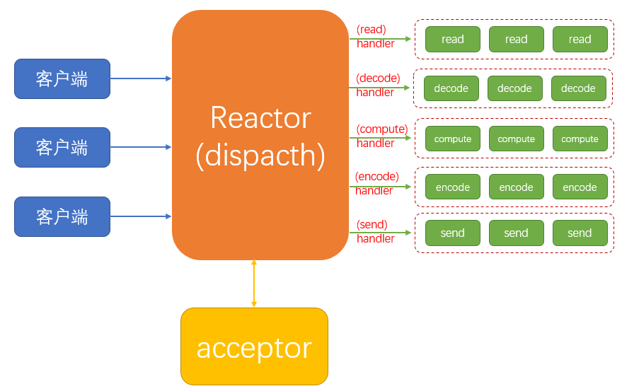
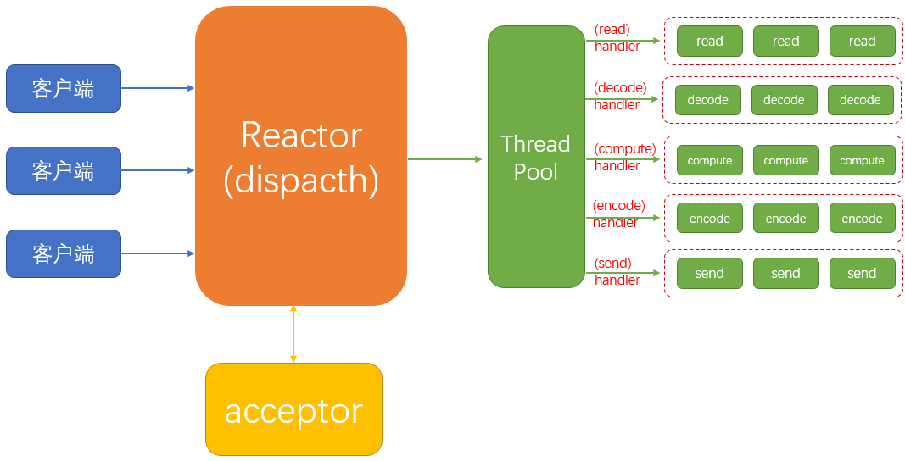
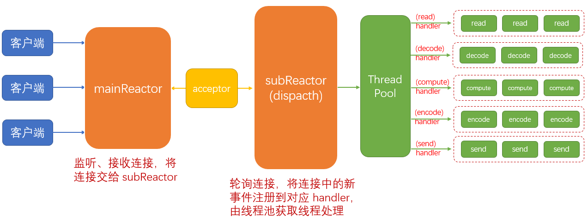

### 三种模式

- BIO，为传统的 thread per connection，阻塞 I/O。类似排队打饭，一个连接数据处理完，在处理下一个连接；
- NIO，为 Reactor 模式，非阻塞 I/O。类似点菜、等待被叫，先接收连接，当有请求时在去处理；
- AIO，为 Procator 模式，异步 I/O。类似包厢，接收连接，当数据处理好通过回调给程序。

### BIO
　　一个线程对应一个 socket，处理所有事情，包含读取请求、解码、计算、写入、发送等。缺点是无法支持大规模请求，假如有 300 个请求，就需要 300 个线程，耗费资源多。


### Reactor 模式
　　**Reactor 模式是事件驱动型的，** 将感兴趣的事件注册到对应 handler，通过轮询扫描发现感兴趣的事件，由对应 handler 进行处理。

#### 单线程的 Reactor
　　Reactor 为单线程，接收连接 socket，并将连接 socket 中的新事件，注册到对应的 handler。

- Reactor，处理连接，将连接中的感兴趣的事件注册到对应的 handler 处理。轮询连接，扫描是否有感兴趣的事件发生，是则进行处理。比如连接 A 有一个新的感兴趣的读事件，则由 (read) handler 处理；
- Handler，有多个不同 handler，负责绑定并处理连接 socket 中的不同事件，比如 (read) handler 只负责绑定处理 read 事件；



```java
// 单线程的 Reactor
EventLoopGroup eventGroup = new NioEventLoopGroup(1);
ServerBootstrap serverBootstrap = new ServerBootstrap();
serverBootstrap.group(eventGroup);
```

#### 多线程的 Reactor
　　由于 Reactor 为单线程，接收多个 socket 请求（多路复用），但处理时只有一个线程。当事件多时，单线程来不及处理 handler 中的多个事件。<br />
　　于是，出现了多线程的 Reactor，有一个线程池，多线程来处理 handler 中的事件。



```java
// 多线程的 Reactor，默认不填写参数的话，netty 会使用一个核两个线程，
// 假设处理器为 4 核，则线程数为 8
EventLoopGroup eventGroup = new NioEventLoopGroup();
ServerBootstrap serverBootstrap = new ServerBootstrap();
serverBootstrap.group(eventGroup);
```

#### 主从多线程的 Reactor
　　对比多线程的 Reactor，主从多线程的 Reactor 有一个专门的 Reactor，负责监听、建立连接，这是与多线程的 Reactor 最大不同的地方。因为建立连接需要三次握手，比较耗时，所以使用一个 Reactor 来专门负责，能提高性能。

- mainReactor，监听、（三次握手）建立接收连接，在将连接交给 subReactor；
- subReactor，轮询连接，将连接中的感兴趣的事件注册到对应 handler，由线程池获取线程处理。



```java
// 主从多线程的 Reactor
EventLoopGroup bossGroup = new NioEventLoopGroup();
EventLoopGroup workerGroup = new NioEventLoopGroup();

ServerBootstrap serverBootstrap = new ServerBootstrap();
serverBootstrap.group(bossGroup, workerGroup);
```

