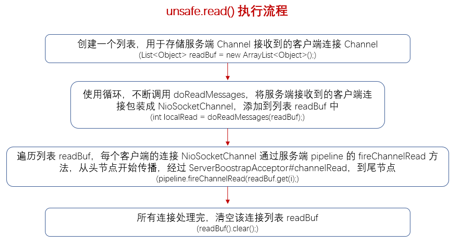

### 服务端 Channel 接收客户端 Channel
　　服务端 Channel 接收客户端 Channel，并将客户端 Channel 注册到 workerGroup 的一个 NioEventLoop，然后客户端 Channel 调用自身的 pipeline，进行 fireChannelActive，往下传播。详细可看 [检测新连接](https://github.com/martin-1992/Netty-Notes/blob/master/%E6%96%B0%E8%BF%9E%E6%8E%A5%E7%9A%84%E6%8E%A5%E5%85%A5/%E6%A3%80%E6%B5%8B%E6%96%B0%E8%BF%9E%E6%8E%A5.md)

- 在服务端 Channel 的启动中，即 [NioEventLoop 的启动](https://github.com/martin-1992/Netty-Notes/blob/master/NioEventLoop/NioEventLoop%20%E7%9A%84%E5%90%AF%E5%8A%A8/README.md)，调用 run() 方法，死循环获取感兴趣的 IO 事件。因为服务端 Channel 感兴趣的就 OP_ACCEPT，即会接受客户端的新连接；
- 然后服务端 Channel 会调用 [NioEventLoop#processSelectedKey()](https://github.com/martin-1992/Netty-Notes/blob/master/NioEventLoop/NioEventLoop%20%E7%9A%84%E5%90%AF%E5%8A%A8/processSelectedKeys.md) 对不同 IO 事件进行轮询处理。调用 [unsafe.read()](https://github.com/martin-1992/Netty-Notes/blob/master/%E6%96%B0%E8%BF%9E%E6%8E%A5%E7%9A%84%E6%8E%A5%E5%85%A5/%E6%A3%80%E6%B5%8B%E6%96%B0%E8%BF%9E%E6%8E%A5.md) 检测到 accpet 或 read 事件进行处理，主要是服务端 Channel 获取客户端的连接 Channel，将其包装成 [NioSocketChannel](https://github.com/martin-1992/Netty-Notes/blob/master/%E6%96%B0%E8%BF%9E%E6%8E%A5%E7%9A%84%E6%8E%A5%E5%85%A5/NioSocketChannel.md)，**设置客户端的连接 Channel 设置禁止 Nagle 算法；**
- 调用 pipeline#fireChannelRead 方法，会从头节点 head 开始往下传播，**传播到 [ServerBootstrap#channelRead](https://github.com/martin-1992/Netty-Notes/blob/master/%E6%96%B0%E8%BF%9E%E6%8E%A5%E7%9A%84%E6%8E%A5%E5%85%A5/ServerBootstrap%23channelRead.md)，会将该客户端 Channel 注册到服务端 Channel 对应的 Selector 上。** 前面讲到在 [Netty 服务端启动过程中会初始化 Channel](https://github.com/martin-1992/Netty-Notes/blob/master/Netty%20%E6%9C%8D%E5%8A%A1%E7%AB%AF%E5%90%AF%E5%8A%A8%E8%BF%87%E7%A8%8B/init.md)，进行配置，包括为该服务端 Channel 的 pipeline 添加 ServerBootstrapAcceptor；**
- 当客户端连接 Channel 注册到 Selector 后，具体注册可看 [register](https://github.com/martin-1992/Netty-Notes/blob/master/Netty%20%E6%9C%8D%E5%8A%A1%E7%AB%AF%E5%90%AF%E5%8A%A8%E8%BF%87%E7%A8%8B/register.md)（这里客户端 Channel 注册到服务端 Selector 流程和服务端 Channel 注册到 Selector 的流程是类似的），**会对该客户端 Channel 调用 [pipeline#fireChannelActive](https://github.com/martin-1992/Netty-Notes/blob/master/%E6%96%B0%E8%BF%9E%E6%8E%A5%E7%9A%84%E6%8E%A5%E5%85%A5/pipeline%23fireChannelActive.md) 进行读事件注册，注意，这里是客户端的 pipeline，** 该方法包含两个方法。
  1. fireChannelActive，继续调用下个节点的 ChannelActive 方法；
  2. readIfIsAutoRead，从尾节点开始，往前调用 read 方法，最终调用头节点的 [DefaultChannelPipeline#read](https://github.com/martin-1992/Netty-Notes/blob/master/%E6%96%B0%E8%BF%9E%E6%8E%A5%E7%9A%84%E6%8E%A5%E5%85%A5/DefaultChannelPipeline%23read.md) 方法，将该 Channel 注册向 Selector 注册对读事件感兴趣，开始读取数据。

