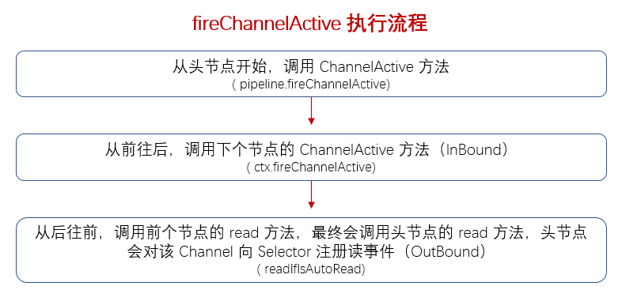

### DefaultChannelPipeline#fireChannelActive
　　pipeline.fireChannelActive 方法从头节点开始，调用头节点的 DefaultChannelPipeline#channelActive 方法，包含两个方法。



- fireChannelActive，继续调用下个节点的 ChannelActive 方法；
- readIfIsAutoRead，从尾节点开始，往前调用 read 方法，最终调用头节点的 [DefaultChannelPipeline#read](https://github.com/martin-1992/Netty-Notes/blob/master/%E6%96%B0%E8%BF%9E%E6%8E%A5%E7%9A%84%E6%8E%A5%E5%85%A5/DefaultChannelPipeline%23read.md) 方法，将该 Channel 注册向 Selector 注册对读事件感兴趣，开始读取数据。

　　InBound 事件是从前往后，OutBound 事件是从后往前。

```java
    @Override
    public final ChannelPipeline fireChannelActive() {
        AbstractChannelHandlerContext.invokeChannelActive(head);
        return this;
    }
```
   
### AbstractChannelHandlerContext#invokeChannelActive
　　不在 EventLoop 线程，则使用线程工厂 executor 创建一个线程放到任务队列中执行。

```java
    static void invokeChannelActive(final AbstractChannelHandlerContext next) {
        EventExecutor executor = next.executor();
        // 当前线程为 EventLoop 线程
        if (executor.inEventLoop()) {
            next.invokeChannelActive();
        } else {
            // 不在 EventLoop 线程，则使用线程工厂 executor
            // 创建一个线程放到任务队列中执行
            executor.execute(new Runnable() {
                @Override
                public void run() {
                    next.invokeChannelActive();
                }
            });
        }
    }
    
    private void invokeChannelActive() {
        if (invokeHandler()) {
            try {
                ((ChannelInboundHandler) handler()).channelActive(this);
            } catch (Throwable t) {
                notifyHandlerException(t);
            }
        } else {
            fireChannelActive();
        }
    }
```

### DefaultChannelPipeline#channelActive

- fireChannelActive，从前往后，调用下个节点的 ChannelActive 方法；
- readIfIsAutoRead，从后往前，从尾节点开始，调用 read 方法开始读取数据。

```java
        @Override
        public void channelActive(ChannelHandlerContext ctx) {
            ctx.fireChannelActive();
            // 自动注册读事件，连接底层对应的 NioEventLoop 对应的 Selector，它可以轮询到一个读事件
            readIfIsAutoRead();
        }
        
        private void readIfIsAutoRead() {
            // 客户端 Channel 和 服务端 Channel 都会调用该函数，默认是自动读的
            // 即默认情况下，绑定端口则接受连接，当前连接绑定到 selector 上，则
            // 会自动读，即向 selector 注册一个读事件
            if (channel.config().isAutoRead()) {
                channel.read();
            }
        }
```

#### AbstractChannel#read
　　从 pipeline 的 tail 开始向前传播读事件。

```java
    @Override
    public Channel read() {
        pipeline.read();
        return this;
    }
    
    /**
     * DefaultChannelPipeline#read
     */
    @Override
    public final ChannelPipeline read() {
        tail.read();
        return this;
    }
```

#### AbstractChannelHandlerContext#read
　　
- findContextOutbound，找到当前节点的前面一个节点 OutBound；
- invokeRead，调用头节点 [DefaultChannelPipeline#read](https://github.com/martin-1992/Netty-Notes/blob/master/%E6%96%B0%E8%BF%9E%E6%8E%A5%E7%9A%84%E6%8E%A5%E5%85%A5/DefaultChannelPipeline%23read.md) ，将该 Channel 向 Selector 注册对读事件感兴趣。

```java
    @Override
    public ChannelHandlerContext read() {
        // 从后往前传播，调用前面一个节点
        final AbstractChannelHandlerContext next = findContextOutbound();
        EventExecutor executor = next.executor();
        if (executor.inEventLoop()) {
            next.invokeRead();
        } else {
            Tasks tasks = next.invokeTasks;
            if (tasks == null) {
                next.invokeTasks = tasks = new Tasks(next);
            }
            executor.execute(tasks.invokeReadTask);
        }

        return this;
    }
    
    private void invokeRead() {
        if (invokeHandler()) {
            try {
                // 调用头节点 headContext 进行读取数据
                ((ChannelOutboundHandler) handler()).read(this);
            } catch (Throwable t) {
                notifyHandlerException(t);
            }
        } else {
            read();
        }
    }
```


#### AbstractChannelHandlerContext#fireChannelActive
　　从前往后传播，获取下个节点 InBoundHandler，调用 ChannelActive。

```java
    @Override
    public ChannelHandlerContext fireChannelActive() {
        invokeChannelActive(findContextInbound());
        return this;
    }
    
    private AbstractChannelHandlerContext findContextInbound() {
        AbstractChannelHandlerContext ctx = this;
        do {
            ctx = ctx.next;
        } while (!ctx.inbound);
        return ctx;
    }
```
