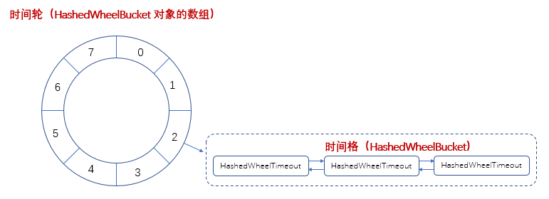

### 原理
　　时间轮是存储定时任务的环形队列，其底层为 HashedWheelBucket 数组，数组中的每个值 HashedWheelBucket 为一个双向链表，HashedWheelBucket 为定时任务的包装类，如下图。



### 执行流程
- 定时任务会先包装成 HashedWheelTimeout，然后根据定时时间计算剩余的轮数和时间格；
- 时间格，Netty 通过一个自增的私有变量 tick(long)，使用位运算 tick & wheel.length(总的格子数) 来获取在时间轮中的时间格索引；
- 时间格的计算，假设一个时间格为 20ms，上图有 8 个时间格，总时间跨度为 20 * 8 = 160m，当前时间格为 3；
    1. 有个定时任务为 40ms 插进任务队列，计算剩余轮数为 40 % 160 = 0，要插入的时间格为 40 / 20 = 2，当前时间格 3 + 2 = 5，插入为 5 的时间格；
    2. 有个定时任务为 180ms 的，计算剩余轮数为 180 % 160 = 1，要插入的时间格为 180 / 160 = 1，当前时间格 3 + 1 = 4，插入为 4 的时间格；
- 执行时间格的任务。
    1. 计算，当前 worker 线程 sleep 到下个格子的执行时间，假设执行上个格子的任务时间花费了 13ms，则 sleep 到下个格子执行的睡眠时间为 20ms - 13ms = 7ms；
    2. 从任务队列中获取定时任务，一次只取 10000 条（每遍历一个时间格，都会执行一次），计算定时时间（相对的），存入时间轮中对应的时间格；
    3. 遍历该格子中的所有定时任务，先判断剩余轮数是否小于等于 0，如果大于 0，表示不在这轮执行的，比如前面提到的 180ms 的任务。对轮数 remainingRounds 减一，这样下轮就可执行该 180ms 的任务。如果剩余轮数小于等于 0，则执行定时任务；
    4. 一直重复上面流程，直到 worker 线程关闭。

### 注意事项
　　时间轮适合执行不需要太精确时间的任务，两个方面。

- 一是在 Netty 代码中是一次只将 10000 个任务存到时间轮中，如果有多于 10000 个的任务，则会放到下一轮处理；
- 二是在将定时任务放到不同时间格时，假设一个时间格的时间跨度为 20ms，当前时间格的任务定时时间为 0ms，下个时间格的定时任务为 20ms。如果当前时间格的任务都执行完花费 73 ms，则会导致下个时间格的任务延迟了 43ms 执行，建议存入时间轮的任务为不耗时的任务。


### 构造函数

- [createWheel](https://github.com/martin-1992/Netty-Notes/blob/master/%E6%97%B6%E9%97%B4%E8%BD%AE%20HashedWheelTimer/createWheel.md)，创建时间轮，在 newTimeout 方法中启动；
- threadFactory.newThread(worker)，创建 [worker](https://github.com/martin-1992/Netty-Notes/blob/master/%E6%97%B6%E9%97%B4%E8%BD%AE%20HashedWheelTimer/Worker.md) 线程，在 newTimeout 方法中会启动 worker 线程，遍历时间轮的所有格子，执行定时任务。

```java
    public HashedWheelTimer(
            // 线程工厂，创建 worker 线程
            ThreadFactory threadFactory,
            // 时间轮的基本时间跨度，即指针多久转一格
            long tickDuration,
            // tickDuration 的时间单位
            TimeUnit unit,
            // 时间轮的时间个数，即一圈有多少格
            int ticksPerWheel,
            // 是否开启内存泄漏检测
            boolean leakDetection,
            // 最大待处理的定时任务数
            long maxPendingTimeouts) {

        if (threadFactory == null) {
            throw new NullPointerException("threadFactory");
        }
        if (unit == null) {
            throw new NullPointerException("unit");
        }
        if (tickDuration <= 0) {
            throw new IllegalArgumentException("tickDuration must be greater than 0: " + tickDuration);
        }
        if (ticksPerWheel <= 0) {
            throw new IllegalArgumentException("ticksPerWheel must be greater than 0: " + ticksPerWheel);
        }

        // Normalize ticksPerWheel to power of two and initialize the wheel.
        // 创建时间轮，用于存储定时任务的环形队列，底层用数组实现
        wheel = createWheel(ticksPerWheel);
        // 用于计算时间轮格子的索引
        mask = wheel.length - 1;

        // Convert tickDuration to nanos.
        // 转换成纳秒
        long duration = unit.toNanos(tickDuration);

        // Prevent overflow.
        // 防止溢出，格子的时间跨度 * 格子数不能大于最大值，即 duration * wheel.length >= Long.MAX_VALUE
        if (duration >= Long.MAX_VALUE / wheel.length) {
            throw new IllegalArgumentException(String.format(
                    "tickDuration: %d (expected: 0 < tickDuration in nanos < %d",
                    tickDuration, Long.MAX_VALUE / wheel.length));
        }

        // 格子的时间跨度太小，使用 MILLISECOND_NANOS
        if (duration < MILLISECOND_NANOS) {
            logger.warn("Configured tickDuration {} smaller then {}, using 1ms.",
                        tickDuration, MILLISECOND_NANOS);
            this.tickDuration = MILLISECOND_NANOS;
        } else {
            this.tickDuration = duration;
        }

        // 创建 worker 线程
        workerThread = threadFactory.newThread(worker);

        // 默认启动内存检测
        leak = leakDetection || !workerThread.isDaemon() ? leakDetector.track(this) : null;
        // 最大待处理的定时任务数
        this.maxPendingTimeouts = maxPendingTimeouts;

        if (INSTANCE_COUNTER.incrementAndGet() > INSTANCE_COUNT_LIMIT &&
            WARNED_TOO_MANY_INSTANCES.compareAndSet(false, true)) {
            reportTooManyInstances();
        }
    }
```

### newTimeout
　　启动 [start](https://github.com/martin-1992/Netty-Notes/blob/master/%E6%97%B6%E9%97%B4%E8%BD%AE%20HashedWheelTimer/start.md) 时间轮，计算定时任务的定时时间，将定时任务包装成 [HashedWheelTimeout](https://github.com/martin-1992/Netty-Notes/blob/master/%E6%97%B6%E9%97%B4%E8%BD%AE%20HashedWheelTimer/HashedWheelTimeout.md) 类，添加到定时任务队列，由 work 线程从定时任务队列中添加到对应的格子中。

```java
    @Override
    public Timeout newTimeout(TimerTask task, long delay, TimeUnit unit) {
        if (task == null) {
            throw new NullPointerException("task");
        }
        if (unit == null) {
            throw new NullPointerException("unit");
        }

        // 定时任务数加一
        long pendingTimeoutsCount = pendingTimeouts.incrementAndGet();
        // 定时任务数超过最大限额，抛出异常
        if (maxPendingTimeouts > 0 && pendingTimeoutsCount > maxPendingTimeouts) {
            pendingTimeouts.decrementAndGet();
            throw new RejectedExecutionException("Number of pending timeouts ("
                + pendingTimeoutsCount + ") is greater than or equal to maximum allowed pending "
                + "timeouts (" + maxPendingTimeouts + ")");
        }
        // 启动时间轮
        start();

        // Add the timeout to the timeout queue which will be processed on the next tick.
        // During processing all the queued HashedWheelTimeouts will be added to the correct HashedWheelBucket.
        // 计算定时任务的定时时间（相对的）
        long deadline = System.nanoTime() + unit.toNanos(delay) - startTime;

        // Guard against overflow.
        // 防止溢出
        if (delay > 0 && deadline < 0) {
            deadline = Long.MAX_VALUE;
        }
        // 将定时任务包装成 HashedWheelTimeout 类，它是一个节点，能添加到 HashedWheelBucket 链表中
        HashedWheelTimeout timeout = new HashedWheelTimeout(this, task, deadline);
        // 先将待执行的定时任务添加到队列 timeouts 中，当 worker 线程启动，检查格子
        // 时，会将（最多 10000 个）任务添加到对应的格子中，然后执行
        timeouts.add(timeout);
        return timeout;
    }
```


